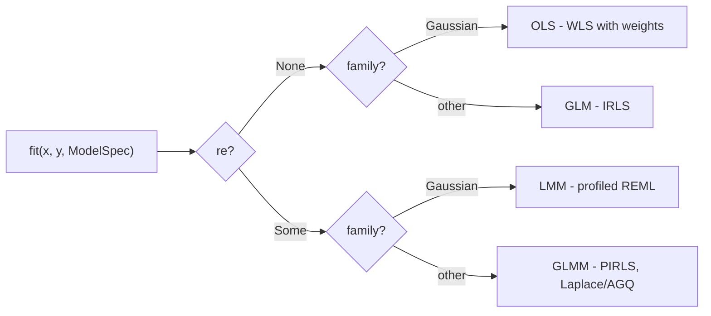

# glmm

[](https://github.com/pawlenartowicz/glmm/actions/workflows/ci.yml)
[](https://crates.io/crates/glmm)
[](https://pypi.org/project/glmm/)
[](https://pawlenartowicz.r-universe.dev/fastglmm)
[](https://docs.rs/glmm)
[](https://www.gnu.org/licenses/gpl-3.0)


**Standalone f64 GLM(M) fit kernels — OLS → GLM → LMM → GLMM — in pure Rust on faer.**

Fits fixed-effect and mixed (random-intercept/random-slope) models for
Gaussian, Binomial (logit/probit), Poisson, Gamma, and Negative-Binomial
outcomes, validated against R/lme4 and Julia/MixedModels.jl goldens.

**New to the crate? Start with [`TUTORIAL-RUST.md`](documentation/TUTORIAL-RUST.md)** — a
single-page, three-layer walkthrough (cold fit → warm fit → advanced loop)
plus a short section on parsing an R-style formula string instead of building
inputs by hand. Python and R packages are also available — see
[Python and R](#python-and-r) below.

## One crate, one `fit`

A single entry point covers the whole linear-regression family. `fit` reads
`ModelSpec` and routes on family × random effects × weights:



This is the pitch view. Every branch point, solver path, and tuning knob is
traced to code in the full algorithm map:
[`documentation/algorithms.md`](documentation/algorithms.md), with the LMM
and GLMM legs detailed in
[`documentation/algorithms-lmm.md`](documentation/algorithms-lmm.md) and
[`documentation/algorithms-glmm.md`](documentation/algorithms-glmm.md).

## Documentation

| File | Purpose |
|---|---|
| [`documentation/TUTORIAL-RUST.md`](documentation/TUTORIAL-RUST.md) | Three-layer Rust walkthrough: cold fit → warm fit → advanced loop, plus the formula frontend |
| [`documentation/TUTORIAL-PYTHON.md`](documentation/TUTORIAL-PYTHON.md) | The Python package (`glmm`) walkthrough |
| [`documentation/TUTORIAL-R.md`](documentation/TUTORIAL-R.md) | The R package (`fastglmm`) walkthrough |
| [`documentation/supported_families.md`](documentation/supported_families.md) | Family × link support matrix, canonical-link notes, dispersion conventions |
| [`documentation/algorithms.md`](documentation/algorithms.md) | Algorithm map entry point: full dispatch graph, knob index, OLS/GLM paths |
| [`documentation/algorithms-lmm.md`](documentation/algorithms-lmm.md) | LMM: θ-Cholesky, profiled REML, closed-form shortcut, BOBYQA, boundary handling |
| [`documentation/algorithms-glmm.md`](documentation/algorithms-glmm.md) | GLMM: PIRLS, Laplace vs AGQ, dense vs sparse Z, NB outer loop, warm starts |
| [`documentation/installation.md`](documentation/installation.md) | Installing the Rust crate, Python package, and R package |
| [`documentation/formula.md`](documentation/formula.md) | What the formula parser accepts and rejects, with workarounds |
| [`documentation/conventions.md`](documentation/conventions.md) | Estimation, standard-error, dispersion, and variance-component conventions, and the flags on a fit result |
| [`documentation/validation.md`](documentation/validation.md) | How glmm is validated against lme4 and MixedModels.jl, what's covered, and known tolerances/exemptions |
| [`documentation/coming-from-lme4.md`](documentation/coming-from-lme4.md) | Call mapping from lme4 (and statsmodels), what's deliberately missing, and behavioral differences to watch |
| [`documentation/troubleshooting.md`](documentation/troubleshooting.md) | Fixes for singular fits, non-convergence, NotImplementedError, and rejected formulas |

## Scope and stability (0.1.x)

The semver-covered surface is `fit_cold`/`fit_warm` + `ModelSpec` + `GroupIds`.

| Model                      | Fixed-only (`re: None`) | Mixed (`re: Some`)                                          |
|-----------------------------|--------------------------|---------------------------------------------------------------|
| Gaussian                    | OLS                      | LMM — dense, or sparse-Z when an extra grouping carries a random slope |
| Binomial (logit/probit)     | GLM                      | GLMM — dense, or sparse-Z over-envelope                          |
| Poisson (log)                | GLM                      | GLMM — dense, or sparse-Z over-envelope                          |
| Gamma (log/inverse)          | GLM                      | GLMM — dense, or sparse-Z over-envelope                          |
| Negative-Binomial (log)      | GLM                      | GLMM — dense, or sparse-Z over-envelope                          |

Every wired family fits through both routes — there is no reachable panic for
falling outside the dense solver's envelope (too many extra groupings, or an
extra grouping too wide); classification just routes to the sparse-Z solver
instead. See [`TUTORIAL-RUST.md`](documentation/TUTORIAL-RUST.md) and
[`documentation/algorithms-glmm.md`](documentation/algorithms-glmm.md) for the
dense/sparse routing envelope.

The `loop_advanced` cargo feature (off by default) exposes an unstable
scratch-explicit hot-path surface for warm-start callers like MCPower's
simulation loop — **no semver guarantees; do not depend on it outside a
pinned revision.**

The `parallel` cargo feature (off by default, **experimental**) enables
in-fit parallelism — the AGQ cluster loop and the FD-Hessian SE grid — via
rayon, and is additionally gated at runtime by `FitOptions::parallel_inner`
(also off by default): both the feature *and* the flag must be on for any
thread to spawn. Parallel results are bit-identical to serial ones, but the
kernels are new and their performance envelope isn't characterized yet —
treat as opt-in only. A no-op on wasm32 (compile-time excluded, rayon never
pulled in).

## Quick example

```rust
use glmm::{fit_cold, Family, FitOptions, GroupIds, ModelSpec, ReStructure, Sizing};

// y ~ x + (1 | group), Gaussian — a random-intercept LMM.
let model = ModelSpec {
    family: Family::Gaussian,
    re: Some(ReStructure {
        sizing: Sizing::FixedClusters { n_clusters: 6 },
        slopes: vec![],
        extra_groupings: vec![],
    }),
};
let ids = GroupIds { primary: vec![0, 1, 2, 3, 4, 5, 0, 1, 2, 3, 4, 5], extra: vec![] };
// target_indices = which coefficients get a standard error; here, both.
let opts = FitOptions { target_indices: vec![0, 1], ..Default::default() };

let fit = fit_cold(&x, &y, n, p, &model, &ids, &opts);
assert!(fit.converged);
```

See [`TUTORIAL-RUST.md`](documentation/TUTORIAL-RUST.md) for the full walkthrough: warm
starts, the advanced hot-loop surface, and building `x`/`ModelSpec`/`GroupIds`
from a formula string with `glmm::formula` (the `formula` feature, on by default)
instead of by hand.

## Python and R

The same kernel ships as a Python package and an R package. Both take a data
table and an R-style formula — no design matrices by hand.

**Python** (`glmm` on PyPI; Python 3.10+, NumPy is the only dependency):

```bash
pip install glmm
```

```python
import glmm

fit = glmm.fit(data, "y ~ x1 + (1 | group)")   # data: dict / pandas / polars
fit.summary()
```

The public surface is two names, `glmm.fit` and `glmm.Fit`. See the
[Python README](python/README.md) and
[`TUTORIAL-PYTHON.md`](documentation/TUTORIAL-PYTHON.md).

**R** (`fastglmm`, via r-universe):

```r
install.packages("fastglmm", repos = c("https://pawlenartowicz.r-universe.dev", getOption("repos")))
```

```r
library(fastglmm)

fit <- fastglmm(y ~ x1 + (1 | group), data)
summary(fit)   # plus fixef, vcov, VarCorr, confint, isSingular
```

Deliberately scoped to fast fitting — anything the engine cannot compute
honestly (`ranef`, `predict`, `logLik`) errors with the reason instead of
guessing. See the [R README](r/README.md) and
[`TUTORIAL-R.md`](documentation/TUTORIAL-R.md).

## Design

| Property       | Detail                                                              |
|----------------|--------------------------------------------------------------------|
| No `unsafe`    | zero `unsafe` (workspace baseline `unsafe_code = "warn"`)           |
| Deterministic  | no RNG, no global state, no I/O in the fit path                     |
| Linear algebra | [`faer`](https://crates.io/crates/faer) 0.24, pinned               |
| MSRV           | Rust 1.85 (floor set by the `bobyqa` dep)                          |

## Origin

`glmm` was carved out of [MCPower](https://github.com/pawlenartowicz/)'s
simulation engine — the numerics here are the same validation-pinned kernels that
power MCPower's Monte Carlo fits, split out so they're usable standalone. The
`loop_advanced` feature above exists specifically to serve MCPower's
warm-start hot loop as a consumer of this crate.

## License

`GPL-3.0-or-later` (coupled to the GPL-3 MCPower flagship).

---
**Paweł Lenartowicz** — [Freestyler Scientist](https://freestylerscientist.pl) · [GitHub](https://github.com/pawlenartowicz/) · [ORCID](https://orcid.org/0000-0002-6906-7217)
