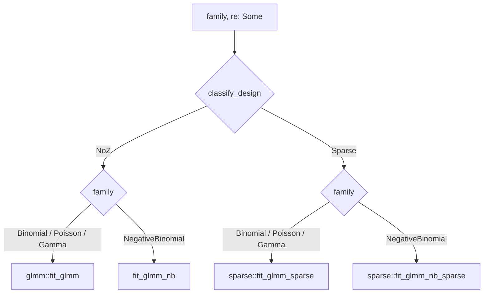
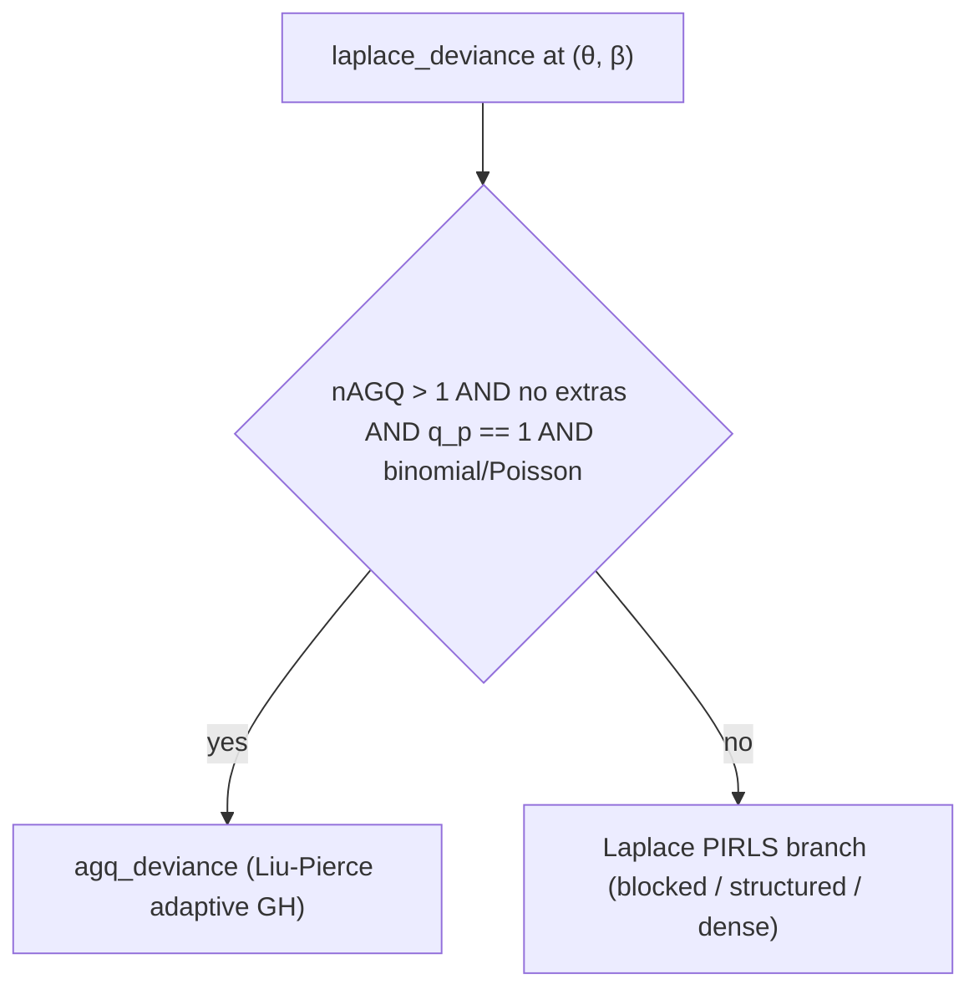

# GLMM — non-Gaussian mixed models

This is the GLMM leaf of the algorithm map: a non-Gaussian `family` with
`re: Some(..)`. It documents what `fit_cold`/`fit_warm` actually run once the
dispatch in [`algorithms.md`](algorithms.md) has selected the GLMM path — the
penalized-IRLS inner loop, the Laplace/AGQ objective, the dense/sparse solver
split, the Negative-Binomial outer θ-loop, workspace reuse, and standard errors.
Family and link coverage is tabled in [`supported_families.md`](supported_families.md).

Each section names its code, the lme4/`glmer` (or `MixedModels.jl`) semantics it
follows, and the parity rungs that pin it. Estimation is `glmer`-faithful
`nAGQ=1` Laplace by default; AGQ (`nAGQ>1`) is an opt-in on one narrow shape.

## Notation

The recurring symbols on this page, defined once here before first use:

- **θ** — the random-effect covariance parameter, in the same relative-Cholesky
  sense as the LMM page; the outer BOBYQA optimises it.
- **Λ = Λ_θ** — the relative Cholesky factor of the random-effect covariance.
- **Z, M** — the random-effect design and its scaled form `M = ZΛ_θ`, the design
  PIRLS actually works in.
- **u / ũ** — the conditional modes of the (reparameterized) random effects,
  with prior `u ~ N(0, I)`; ũ is the converged mode.
- **η, μ, W** — the linear predictor, the conditional mean (`link⁻¹` of η), and
  the IRLS working weights.
- **A = MᵀWM + I** — the penalized-IRLS system matrix at the mode; one Cholesky
  of A yields both the u-step and `log|A|`.
- **β** — the fixed effects. In the objective, dispersion is fixed at 1 for
  every family except Gamma (NB's θ is a shape parameter handled by the outer
  loop, not an objective dispersion).
- **nAGQ** — the Gauss–Hermite node count; `nAGQ=1` is the Laplace case.
- **d(y, ũ)** — the family deviance evaluated at the converged mode.

## Dispatch within the GLMM path

**Code:** `classify_design` and the `(family, Some(re))` arm of `fit_dispatch`
in `src/fit.rs`; envelope caps in `src/consts.rs` (`MAX_PRIMARY_Q`,
`MAX_EXTRA_GROUPINGS`, `MAX_EXTRA_Q`, `MAX_CROSSED_LEVELS`).

`classify_design` returns `Solver::NoZ` (the dense clustered kernel) or
`Solver::Sparse`. A design routes **Sparse** when it is over the dense envelope
(`q_p > 8`, more than 6 extra groupings, or any extra grouping with
`1 + slopes.len() > 4`), when *any* extra grouping carries a random slope, or
when the total crossed level count exceeds `MAX_CROSSED_LEVELS`; otherwise it
stays **NoZ**. Within each solver, the family selects the entry point:

(Gaussian `re: Some` is the LMM path — `fit_mle` / `fit_mle_sparse` — covered in
[`algorithms-lmm.md`](algorithms-lmm.md), not here.) Every wired family fits on
both solver arms: there is **no reachable `unimplemented!`** in the GLMM
dispatch. The only hard rejections are shape asserts at the stable boundary
(`src/fit.rs`): `assert_model_shape` requires `nAGQ` odd in `1..=25` and allows
`nAGQ>1` only on a single scalar-intercept binomial/Poisson GLMM; a separate
assert in `fit_warm` panics on prior weights combined with `nAGQ>1`
(`"FitOptions.weights with nAGQ > 1 is not supported"`).

**Validation:** the NoZ binomial/Poisson/Gamma path is pinned by cbpp
(`fit::tests::fit_glmm_cbpp_matches_lme4`), grouseticks
(`fit_glmm_poisson_grouseticks_matches_lme4`) and the Gamma goldens
(`fit_glmm_gamma_sim_matches_lme4`, `goldens/sim_gamma_glmm.json`); the Sparse
arm by `sim_binomial_slope_crossed` (a slope-carrying crossed extra →
`fit_sparse_binomial_slope_crossed_matches_lme4` in `src/sparse.rs`) and the
over-count sparse rungs `sim_sparse_binomial` / `sim_sparse_poisson` (rungs 8–9,
green against both lme4 and MixedModels.jl).

## PIRLS inner loop

**Code:** `pirls_solve` (dense fallback), `pirls_solve_blocked` (no extras) and
`pirls_solve_blocked_extras` (structured crossed/nested) in
`src/glmm/pirls.rs`; caps `PIRLS_MAX_ITERS = 50`, `PIRLS_MAX_HALVINGS = 10` and
the tolerance selector `pirls_tol` in `src/glmm/mod.rs`.

At a fixed θ the conditional modes ũ are found by penalized IRLS — Fisher
scoring on the penalized likelihood. The RE design is the scaled `M = ZΛ_θ`, and
the penalty adds a `+I` ridge; this is the standard `nAGQ=1` reparameterization,
under which the prior is `u ~ N(0, I)`. Each iteration forms `A = MᵀWM + I` and
the IRLS right-hand side `Mᵀ(W·Mu + (y − μ))`, then takes the next `u` from a
dense Cholesky solve of `A`. `log|A|` is read off that same converged factor, so
the deviance term needs no re-factorization. Three variants handle the RE
structure: the no-extras path exploits the block-diagonal `A` (per-cluster
factors in `a_blocks`); the structured path splits `A` into a block-diagonal core
plus a Schur complement on the crossed width; the dense fallback factors the full
`A`.

Convergence follows the lme4 `pwrss` rule: exit when
`|mixed − mixed_prev| < PIRLS_TOL_REL · (1 + |mixed|)`, checked after each step.
Here `mixed = dev(uⱼ) + ‖uⱼ₊₁‖²` is the cross-step penalized deviance carried
between iterations, so the band scales with the penalized deviance itself, not
the penalty term alone.

The tolerance is link-dependent, selected by `pirls_tol`. Canonical links (logit,
Poisson-log) are Newton with quadratic convergence, and use
`PIRLS_TOL_REL = 1e-9`. Non-canonical links (probit, Gamma-log/inverse, NB-log)
are Fisher-scoring with only linear convergence, and use
`PIRLS_TOL_REL_NONCANON = 1e-8`. That non-canonical value is a decade looser than
the canonical exit — Newton overshoots its tolerance to machine precision for
free, whereas every extra Fisher-scoring digit costs iterations. It is
nonetheless tightened far below the historical 1e-6 default, so the non-canonical
deviance stays smooth enough for the outer optimizer and the FD-Hessian SE.

**Step-halving** mirrors lme4 `pwrssUpdate`'s 10-halving discipline, in its
retrospective form. The trial `u` is evaluated first. Only if its same-point
penalized deviance rises above the last accepted value by more than the tolerance
band is `δu = u − u_prev` halved and re-evaluated — up to `PIRLS_MAX_HALVINGS`
times, after which the solve reports failure `(NaN, NaN, NaN, false)`. A
within-band rise is treated as FP noise near the optimum and accepted without
burning a halving. In Profile mode (below) the joint `(u, β)` step is backtracked
in lockstep, halving β toward `beta_prev` alongside `u`.

**Convention/reference:** this is `glmer`'s `nAGQ=1` inner PIRLS; the halving is
lme4's retrospective `pwrssUpdate`. **Validation:** every binomial/Poisson/Gamma
GLMM rung exercises it — cbpp, grouseticks, VerbAgg (the n=7584 individual-
Bernoulli rung whose PIRLS exit tolerance the `PIRLS_TOL_REL` doc comment tunes),
and the Gamma/NB goldens. The step-halving specifically recovers the
grouseticks 3-crossed β=0 cold start
(`fit_glmm_poisson_grouseticks_3crossed_matches_lme4`).

### β profiling — the two-stage optimizer

**Code:** `BetaStep::{Fixed, Profile}` in `src/glmm/pirls.rs`; the two-stage
driver in `glmm::fit_glmm` (`src/glmm/mod.rs`), gated by `GlmmWorkspace.two_stage`.

The outer search over θ (and β) is a two-stage BOBYQA, following lme4's
θ-then-joint structure (Bates et al., *JSS* 67(1), 2015, §3). **Stage 1** runs
BOBYQA over θ alone; at each candidate θ the PIRLS inner loop runs in
`BetaStep::Profile`, adding a δβ Schur-border update every iteration so it
returns the jointly PQL-optimal `(ũ, β̂)` for that θ. Stage 1 is purely a
warm-start accelerant — it never gates convergence and is skipped bit-identically
when `two_stage == false` or `nAGQ>1`. **Stage 2** is a joint `[θ | β]` BOBYQA
polish on the true Laplace objective, warm-started from stage 1, and its status
alone decides `converged`; the reported `(θ̂, β̂)` is therefore always the Laplace
optimum, not the PQL one. Stage-2 objective evals hold β fixed
(`BetaStep::Fixed`), so PIRLS solves only for ũ(β). **Validation:**
`two_stage_matches_single_stage_on_grouseticks` (in `src/glmm/tests.rs`) pins the
A/B equivalence; cbpp and grouseticks pin the fitted optimum.

## Laplace approximation

**Code:** `laplace_deviance` in `src/glmm/deviance.rs`.

The `nAGQ=1` marginal objective is the Laplace deviance
`d(y, ũ) + ‖ũ‖² + log|A|`, where `A = MᵀWM + I` at the converged mode ũ and the
`+I` is the same ridge the penalty `‖ũ‖²` carries. Concretely the return is
`data_term + pen + 2·logdet`. For binomial and Poisson the data term is the bare
deviance `D` (`glmer` substitutes the family `aic = D + const`, same minimizer,
kept as `D` for byte-identity). **Gamma** is the sole exception: its data term is
`family::gamma_aic`, which profiles the dispersion as `D/n`, making the objective
a nonlinear function of `D` — the only route by which dispersion shifts `glmer`'s
β̂/τ̂. No σ² scale enters the binomial/Poisson objective (dispersion fixed at 1).
Non-convergence or a Cholesky failure returns `f64::INFINITY`, the module's
failure surface.

**Convention/reference:** `glmer`'s `nAGQ=1` `devfun` (profiled Laplace
deviance), with the `aic`-for-deviance substitution and the Gamma `aic`
dispersion-profiling both matching lme4. **Validation:** cbpp (binomial),
grouseticks (Poisson), the Gamma golden `sim_gamma_glmm`, and the white-box
k=1 ≡ Laplace reduction asserted in `src/glmm/tests.rs`.

## Adaptive Gauss–Hermite quadrature (AGQ)

**Code:** `agq_deviance` in `src/glmm/agq.rs`; the gate in `laplace_deviance`
(`src/glmm/deviance.rs`); GH tables `GH_NODES`/`GH_WEIGHTS`/`GH_OFFSETS` and
`MAX_NAGQ = 25` in `src/consts.rs`.

AGQ (`nAGQ>1`) applies only where the marginal likelihood factorizes into
independent 1-D cluster integrals: a **single scalar-intercept binomial/Poisson
GLMM**. The gate in `laplace_deviance` requires `nagq > 1`, no extra groupings,
`primary_q == 1`, and a binomial/Poisson family; every other shape (and
`nagq == 1`) falls through to the Laplace path unchanged.

`agq_deviance` first converges each cluster's mode ũ_c and curvature A_c via the
same blocked PIRLS, then integrates the conditional likelihood with `k = nAGQ`
adaptive Gauss–Hermite nodes `u_cj = ũ_c + √2·σ_c·z_j` (`σ_c = 1/√A_c`),
combined by log-sum-exp with the Liu–Pierce (1994) reweight `w_j·e^{z_j²}`. At
`k = 1` the single node sits at the mode with weight √π and the bracket
collapses to the Laplace term exactly — so `nagq == 1` routes to
`laplace_deviance` verbatim. `nAGQ` must be **odd** (the GH table stores orders
`1, 3, …, 25`), enforced by `assert_model_shape`. AGQ has **no sparse
counterpart** and rejects prior weights at the boundary.

**Convention/reference:** `glmer(nAGQ=k)` with Liu–Pierce adaptive centering at
each cluster's PIRLS mode/curvature. **Validation:** in-crate goldens
`fit_glmm_binomial_agq_matches_lme4` and `fit_glmm_poisson_agq_matches_lme4`
(against `goldens/cbpp_agq_k{1,7,11}.json` and
`goldens/grouseticks_agq_k{1,7,11}.json`). AGQ is **not** part of the 3-way
`parity/` sweep — that corpus is pinned to Laplace (`nAGQ=1`) so it can compare
like-to-like across lme4, MixedModels.jl and glmm; AGQ lives in the goldens
track alone, since it is fundamentally an lme4-vs-glmm comparison.

## Dense vs sparse-Z solvers

**Code:** dense clustered kernel `glmm::fit_glmm` (`src/glmm/mod.rs`) with the
three PIRLS variants; sparse driver `sparse::fit_glmm_sparse` /
`sparse::fit_glmm_nb_sparse` (`src/sparse.rs`); router `classify_design`
(`src/fit.rs`).

The dense (`NoZ`) kernel never materializes a sparse Z: with no extras `A` is
block-diagonal and rebuilt per row; intercept-only crossed/nested extras use the
structured core-plus-Schur factorization; a genuinely dense `A` (oversized core)
uses the dense fallback. It implements **intercept-only** extra groupings only —
`build_z` emits no slope columns for extras. Any design that needs full q_g×q_g
Λ-blocks per extra level (a slope-carrying extra), or that busts the envelope
caps, or that has too many crossed levels, is routed by `classify_design` to the
**sparse** driver, whose PIRLS applies the full per-level Λ-blocks. Because the
router redirects rather than aborts, the caps are a routing boundary, not a
panic — every family fits on whichever side it lands.

**Convention/reference:** both solvers target the identical `glmer` Laplace
optimum; the sparse path differs only in linear algebra (sparse Cholesky over
the full Z), not in objective, so a BOBYQA optimum is shared. **Validation:**
the sparse Schur/deviance are cross-checked against the dense kernel on
grouseticks (`sparse_schur_deviance_equals_dense_grouseticks`,
`sparse_schur_se_equals_dense_grouseticks`); external truth is
`sim_binomial_slope_crossed` (slope-carrying crossed extra), `sim_sparse_binomial`
and `sim_sparse_poisson` (rungs 8–9, both reference engines), plus the
lme4-only sparse Gamma/NB goldens `sim_sparse_gamma` / `sim_sparse_nb`.

## Negative-Binomial outer θ-loop

**Code:** `fit_glmm_nb` (dense) and `sparse::fit_glmm_nb_sparse` (sparse) in
`src/fit.rs` / `src/sparse.rs`; the shared 1-D search `golden_max_ln_theta`, the
marginal-θ objective term `nb_profile_loglik`, and caps `NB_THETA_LO = 1e-3`,
`NB_THETA_HI = 1e4` in `src/fit.rs`.

The NB shape parameter θ is not carried in the spec — the spec is θ-free and θ̂
is threaded into `fit_glmm` explicitly per candidate. `fit_glmm_nb` maximizes the
**marginal** log-likelihood over `ln θ` on the bracket `[ln 1e-3, ln 1e4]` by
golden-section (the NB likelihood is far more symmetric in `ln θ` than in θ). The
objective at each candidate is `logL_marginal = −½·deviance +
nb_profile_loglik(y, y, θ)`, where `deviance` is the converged NB GLMM Laplace
deviance from a full inner `fit_glmm` and the second term is the NB
saturated-reference log-likelihood on the same (weighted) scale. The final β/SE
come from one more `fit_glmm` at the converged θ̂, and θ̂ is reported as the fit's
`dispersion`. (This differs from the *GLM* NB path `fit_glm_nb`, which uses an
alternating fixed-θ / profile-θ outer loop capped at `NB_MAX_OUTER = 25` with
`|Δθ|/θ < NB_THETA_TOL = 1e-6`; the GLMM path uses the single global golden-
section bracket instead, since a warm θ seed is irrelevant to a global search.)

**Convention/reference:** the θ profile mirrors `MASS::theta.ml` (integer counts
give `lnΓ(y+θ) − lnΓ(θ) = Σ_{k<y} ln(θ+k)` exactly, no lgamma); the outer
marginal-θ maximization matches `lme4::glmer.nb`. The β SE conditions on θ̂
(θ-uncertainty out of scope, the lme4/MASS convention). **Validation:**
`fit_glmm_nb_sim_matches_lme4` against `goldens/sim_nb_glmm.json` (dense); the
sparse NB path by `goldens/sim_sparse_nb.json`.

## Warm starts and workspace reuse

**Code:** `GlmmWorkspace::for_cluster_spec` / `from_groupings` in
`src/glmm/workspace.rs`; within-fit seeding in `glmm::fit_glmm`
(`src/glmm/mod.rs`); the `loop_advanced` reuse surface (see
[`TUTORIAL-RUST.md`](TUTORIAL-RUST.md) §3).

All GLMM solver scratch lives in one `GlmmWorkspace`, allocated **once per
(spec, max_n) shape** — its buffers depend only on `(groupings, family, p,
max_n, nAGQ)`, never on the data values. Every buffer is sized to `max_n` rows
and `k` RE columns (with `n_theta` and `p` fixed by the spec), so a single
workspace is reused across every BOBYQA evaluation and PIRLS iteration of one
fit with no reallocation; the warm path is zero-alloc (BOBYQA is constructed
once). A workspace is **invalidated** — a fresh one is required — when the row
count exceeds `max_n`, when `p` changes, or when the RE topology changes (any
shift in `k`, `n_theta`, the groupings, the family, or `nAGQ`), because those
resize the scratch or the optimizer dimension.

Two seeding mechanisms feed the optimizer. Across fits, a caller-supplied
`StartValues` threads β and θ into the search (`fit_warm`; the dense GLMM kernel
warm-starts both, unlike the LMM kernel which seeds θ only). A cold start seeds β
from the no-RE GLM fit (`glm_warm_start_beta`, lme4/`glmer`'s own initialization)
and θ from the blind `THETA0`. Within a fit, `u_seed` holds the conditional-mode
warm start incumbent, but it is **reset to 0 at the start of every `fit_glmm`**
and never carried across fits — the conditional mode is point-determined given
(θ, β), so the seed only shifts the stopping iterate within the PIRLS exit band,
and a cross-fit carry is deliberately rejected (it would break same-seed
reproducibility). At the stable `fit_cold`/`fit_warm` surface the workspace is
built per call; the `loop_advanced` cargo feature is what exposes explicit
cross-fit reuse for hot loops.

**Validation:** the warm/cold equivalence is a MLE property (start-independent
optimum), exercised implicitly by every rung; the zero-alloc reuse discipline is
the `loop_advanced` MCPower hot-loop surface.

## Standard errors

**Code:** the `WaldSe` arms in `glmm::fit_glmm` and `fd_hessian_cov` /
`rx_cov_into` in `src/glmm/se.rs`; the sparse twins `sparse_fd_hessian_cov` and
the sparse Rx Schur in `src/sparse.rs`; `FD_STEP_REL = 1e-2` and
`PIRLS_TOL_REL_FD = 1e-8` in `src/glmm/mod.rs`.

Two genuinely different Wald covariances are offered, selected by `WaldSe`:

- **`WaldSe::Hessian`** (the default, matching `glmer` `vcov(use.hessian =
  TRUE)`): the fixed-effect covariance is the β-block of `2·H_dev⁻¹`. Here
  `H_dev` is the finite-difference Hessian of the joint `(θ, β)` Laplace
  deviance at the converged point. The factor of 2 arises because the deviance
  is −2·logL, so the observed information is `H_dev/2`. `fd_hessian_cov` uses
  single-step central second differences at `h_k = FD_STEP_REL · max(1, |γ̂_k|)`,
  with no Richardson extrapolation — the deviance is step-invariant over
  `h ∈ [1e-4, 1e-1]`. Every FD deviance eval re-runs PIRLS at the tight
  `PIRLS_TOL_REL_FD = 1e-8` (not the fit tolerance), so the second differences
  are step-invariant by construction rather than by luck. If the joint Hessian
  is non-PD, or a perturbed deviance is non-finite (the few-cluster failure
  mode), it falls back to the Rx/Schur covariance and reports
  `FdHessianStatus::NonPdFellBackToRx`.

- **`WaldSe::Rx`** (conditional on θ̂): inverts the expected-information Schur
  complement of the β block directly (`rx_cov_into`, via `blocked_` /
  `structured_` / `dense_schur_fill`). This is fast — one closed-form Schur
  solve, reusing the factors PIRLS left behind. Its cost is an assumption of
  β–θ orthogonality: exact for the Gaussian LMM, but anticonservative for a
  GLMM, where the IRLS weights couple β and θ. Gamma carries lme4's σ̂² on this
  vcov (`vcov(use.hessian = FALSE) = σ̂²·Schur⁻¹`); fixed-scale families use
  σ̂² ≡ 1.

Both are computed on the deviance/log-odds scale (the fit's linear-predictor
scale). The sparse driver emits the same two arms: `sparse_fd_hessian_cov`
mirrors the dense FD scheme exactly, with the identical Rx fallback. The Hessian
arm is the dominant time cost (≈ O(m²) deviance re-solves); on cbpp the Hessian
fit is ~1.9× its Rx fit.

**Convention/reference:** `WaldSe::Hessian` ≡ `glmer` `vcov(use.hessian = TRUE)`
(numDeriv Hessian of the Laplace deviance); `WaldSe::Rx` ≡
`vcov(use.hessian = FALSE)` and the MixedModels.jl vcov. **Validation:** the
committed fixture `tests/fixtures/glmm_hessian_vcov.json` (n=96 /
12-cluster `y ~ x1 + (1|grp)`) pins the FD scheme; in the `parity/` sweep the two
methods are gated separately — `se_rx` against all three engines
(cbpp, grouseticks; glmm sits on the MixedModels value, ~6e-7 on cbpp) and
`se_hessian` against lme4 alone (`n/a` for MixedModels, which has no Hessian
vcov), each at ~1e-3 once the references are generated at tightened
`tolPwrss = 1e-13`.

## Validation

The GLMM paths are held to the frozen `parity/` oracle (`parity/README.md`) —
two independent reference engines (R `lme4`, Julia `MixedModels.jl`) agreeing
within tolerance is the truth condition; on any disagreement glmm is presumed
wrong. Estimation is pinned to Laplace (`nAGQ=1`) across the sweep so all three
engines compare like-to-like. Of the 21 roadmap rungs, **nine are landed** on
the glmm side (rungs 1–9); the GLMM ones among them are cbpp,
grouseticks, `sim_sparse_binomial` and `sim_sparse_poisson`. Directly relevant
rungs and goldens:

| Path | Rung / golden | Reference | Status |
|---|---|---|---|
| Binomial GLMM, dense | cbpp (rung 5) | lme4 + MixedModels.jl | landed |
| Poisson GLMM, dense | grouseticks (rung 6) | lme4 + MixedModels.jl | landed |
| Sparse over-count binomial | `sim_sparse_binomial` (rung 8) | lme4 + MixedModels.jl | landed |
| Sparse over-count Poisson | `sim_sparse_poisson` (rung 9) | lme4 + MixedModels.jl | landed |
| Binomial, individual 0/1 | VerbAgg (rung 12) | lme4 + MixedModels.jl | roadmap (used to tune `PIRLS_TOL_REL`) |
| Poisson, real nested | Arabidopsis (rung 14) | lme4 + MixedModels.jl | roadmap |
| Sparse binomial, slope-crossed | `sim_binomial_slope_crossed` (rung 18) | lme4 (+ glmm golden) | roadmap rung; in-crate golden gated |
| Probit GLMM (non-canonical) | `goldens/cbpp_probit_glmm.json` (`fit_glmm_probit_cbpp_matches_lme4`) | lme4 | in-crate golden |
| Gamma GLMM, dense | `goldens/sim_gamma_glmm.json` (`fit_glmm_gamma_sim_matches_lme4`) | lme4 | in-crate golden |
| NB GLMM, dense | `goldens/sim_nb_glmm.json` (`fit_glmm_nb_sim_matches_lme4`) | lme4 | in-crate golden |
| AGQ (nAGQ 1/7/11) | `goldens/{cbpp,grouseticks}_agq_k{1,7,11}.json` | lme4 | in-crate golden |
| Sparse Gamma / NB | `goldens/sim_sparse_gamma.json`, `goldens/sim_sparse_nb.json` | lme4 | in-crate golden |

Some paths have no dedicated rung: the intercept-only nested/crossed *structured*
non-Gaussian branch is validated only indirectly, via the grouseticks
dense-vs-sparse cross-checks and the sparse over-count rungs, rather than by a
standalone golden.

## References

- Bates, D., Mächler, M., Bolker, B. & Walker, S. (2015). Fitting Linear
  Mixed-Effects Models Using lme4. *Journal of Statistical Software*, 67(1),
  1–48. — the PIRLS/Laplace `devfun`, the θ-then-joint two-stage structure
  (§3), and the `pwrssUpdate` step-halving discipline.
- Liu, Q. & Pierce, D. A. (1994). A note on Gauss–Hermite quadrature.
  *Biometrika*, 81(3), 624–629. — the adaptive-GH centering/reweighting
  `agq_deviance` implements.
- Powell, M. J. D. (2009). *The BOBYQA algorithm for bound constrained
  optimization without derivatives*. Report DAMTP 2009/NA06, University of
  Cambridge. — the outer optimizer for both stages.
- Venables, W. N. & Ripley, B. D. (2002). *Modern Applied Statistics with S*
  (4th ed.). Springer. — `MASS::theta.ml`, the NB θ-profile convention.
