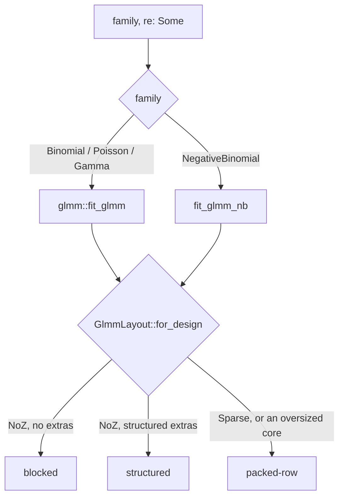
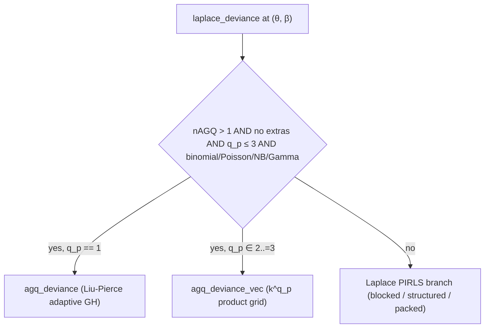

# GLMM — non-Gaussian mixed models

This is the GLMM leaf of the algorithm map: a non-Gaussian `family` with
`re: Some(..)`. It documents what `fit_cold`/`fit_warm` actually run once the
dispatch in [`algorithms.md`](algorithms.md) has selected the GLMM path — the
penalized-IRLS inner loop, the Laplace/AGQ objective, the dense/sparse solver
split, the Negative-Binomial outer θ-loop, workspace reuse, and standard errors.
Family and link coverage is tabled in [`supported_families.md`](supported_families.md).
The page ends with a [comparison](#how-the-other-engines-fit-a-glmm) against
lme4, MixedModels.jl, and GLMMadaptive.

Each section names its code, the lme4/`glmer` (or `MixedModels.jl`) semantics it
follows, and the validation rungs that pin it. Estimation is `glmer`-faithful
`nAGQ=1` Laplace by default; AGQ (`nAGQ>1`) is an opt-in on a single grouping
factor with up to 3 random effects per group, binomial/Poisson/negative-binomial/Gamma.

## Notation

The recurring symbols on this page, defined once here before first use:

- **θ** — the random-effect covariance parameter, in the same relative-Cholesky
  sense as the LMM page; the outer BOBYQA optimises it.
- **Λ = Λ_θ** — the relative Cholesky factor of the random-effect covariance.
- **Z, M** — the random-effect design and its scaled form `M = ZΛ_θ`, the design
  PIRLS actually works in.
- **u / ũ** — the conditional modes of the (reparameterized) random effects,
  with prior `u ~ N(0, I)`; ũ is the converged mode.
- **η, μ, W** — the linear predictor, the conditional mean (`link⁻¹` of η), and
  the IRLS working weights.
- **A = MᵀWM + I** — the penalized-IRLS system matrix. `W` is the exact
  curvature `W_obs = −∂²ℓᵢ/∂ηᵢ²`, both in the PIRLS step (a Newton step) and
  in the objective's `log|A|` at the mode. It is the Fisher weight on a
  canonical link and differs from it on probit, cloglog, Gamma/log and NB/log
  (see [Laplace approximation](#laplace-approximation)).
- **β** — the fixed effects. In the objective, dispersion is fixed at 1 for
  every family except Gamma, whose φ is a free parameter searched by the outer
  loop as `ln φ` (NB's θ is a shape parameter searched the same way).
- **nAGQ** — the Gauss–Hermite node count; `nAGQ=1` is the Laplace case.
- **d(y, ũ)** — the family deviance evaluated at the converged mode.

## Dispatch within the GLMM path

**Code:** `classify_design` and the `(family, Some(re))` arm of the dispatch
match in `fit_warm` (`src/fit/mod.rs`); `assert_model_shape`
(`src/fit/common.rs`); envelope caps in `src/consts.rs` (`MAX_PRIMARY_Q`,
`MAX_EXTRA_GROUPINGS`, `MAX_EXTRA_Q`, `MAX_CROSSED_LEVELS`).

`classify_design` returns `Solver::NoZ` (the dense clustered kernel) or
`Solver::Sparse`. A design routes **Sparse** when it is over the dense envelope
(`q_p > 8`, more than 6 extra groupings, or any extra grouping with
`1 + slopes.len() > 4`), when *any* extra grouping carries a random slope, or
when the total crossed level count exceeds `MAX_CROSSED_LEVELS`; otherwise it
stays **NoZ**. (For a slope-carrying extra `Solver::Sparse` is not a speed
choice: only the packed-row `A`-layout applies a full `q_g×q_g` Λ block per
extra level.) On the non-Gaussian side `classify_design`'s answer selects the
`A`-layout, not a separate driver — every family reaches the same entry point:


```mermaid
flowchart TD
  A["family, re: Some"] --> C{family}
  C -->|"Binomial / Poisson / Gamma"| E["glmm::fit_glmm"]
  C -->|NegativeBinomial| F["fit_glmm_nb"]
  E --> L{"GlmmLayout::for_design"}
  F --> L
  L -->|"NoZ, no extras"| M["blocked"]
  L -->|"NoZ, structured extras"| N["structured"]
  L -->|"Sparse, or an oversized core"| O["packed-row"]
```

(Gaussian `re: Some` is the LMM path — `fit_lmm` — covered in
[`algorithms-lmm.md`](algorithms-lmm.md), not here.) Every family that reaches
this match fits on both solver arms: there is **no reachable `unimplemented!`**
once dispatch is inside the GLMM path. The hard rejections are the shape
asserts at the stable boundary (`assert_model_shape`, `src/fit/common.rs`):
`nAGQ` must be odd in `1..=25`, and `nAGQ>1` is allowed only on a single
grouping factor (no extras), `q_p ≤ 3` random effects per group,
binomial/Poisson/negative-binomial/Gamma GLMM. The same assert also checks the engine invariants that
hold at `nAGQ = 1`: every primary/extra slope column must index within `p`,
and at most one `NestedWithin` extra grouping is accepted. It also rejects
`(Family::InverseGaussian, Some(re))` outright — a family × random-effects
gate rather than a shape gate — because the GLMM objective needs a profiled
`inverse.gaussian()$aic` term that is not built, so `InverseGaussian` never
reaches the `family` diamond above; it faults before `build_workspace`
allocates anything, and is otherwise a fixed-only GLM family (see
[`algorithms.md`](algorithms.md#full-dispatch-map)). Prior weights are **not**
a rejection anywhere on this path — `FitOptions::weights` is honored on every
GLMM shape, AGQ included (see the weights paragraph in the PIRLS section).

**Validation:** the NoZ binomial/Poisson/Gamma path is pinned by cbpp
(`fit_glmm_cbpp_matches_lme4`), grouseticks
(`fit_glmm_poisson_grouseticks_matches_lme4`) and the Gamma goldens
(`fit_glmm_gamma_sim_matches_grid_reference`, grid cell `sim_gamma`); the Sparse
arm (the packed-row layout) by `sim_binomial_slope_crossed` (a slope-carrying
crossed extra → `fit_sparse_binomial_slope_crossed_is_pinned` in
`src/sparse/tests.rs`) and the over-count rungs `sim_sparse_binomial` / `sim_sparse_poisson`
(rungs 8–9, green against both lme4 and MixedModels.jl).

## PIRLS inner loop

**Code:** `pirls_solve_packed` (packed-row, `src/glmm/pirls/packed.rs`),
`pirls_solve_blocked` (no extras, `src/glmm/pirls/blocked.rs`) and
`pirls_solve_blocked_extras` (structured crossed/nested,
`src/glmm/pirls/blocked_extras.rs`); caps `PIRLS_MAX_ITERS = 200`,
`PIRLS_MAX_HALVINGS = 16`, the period-2 detector's `PIRLS_OSC_RATIO = 0.8` and
`PIRLS_OSC_TRIGGER = 3`, and the tolerance selector `pirls_tol` in
`src/glmm/mod.rs`.

At a fixed θ the conditional modes ũ are found by penalized IRLS — Newton's
method on the penalized likelihood. The RE design is the scaled `M = ZΛ_θ`, and
the penalty adds a `+I` ridge; this is the standard `nAGQ=1` reparameterization,
under which the prior is `u ~ N(0, I)`. Each iteration forms `A = MᵀWM + I` and
the IRLS right-hand side `Mᵀ(W·Mu + (y − μ))`, then takes the next `u` from a
Cholesky solve of `A`. `log|A|` is read off that same factor, so the
deviance term needs no re-factorization. The factor is built from W at the
iterate the last step started from, not at the returned `u` — see
[§Laplace approximation](#laplace-approximation). Three variants handle the RE
structure:

- **Blocked** (no extra groupings): `A` is block-diagonal, one `q_p×q_p` block
  per cluster, factored per cluster in `a_blocks`.
- **Structured** (intercept-only crossed/nested extras): `A` splits into a
  block-diagonal core plus a Schur complement on the crossed width. Concretely
  (`structured_factor` / `structured_ainv_solve`): per-cluster core blocks of
  width `q_core = q_p + nested-children-per-parent` (`core_blocks`), the
  cluster↔crossed coupling `C_f` (`coupling`, with a per-cluster CSR
  `coup_cols`/`coup_ptr` that skips exact-zero columns and is rebuilt only when
  the θ-pinning mask changes), and the crossed-width Schur complement
  `S = (E + I) − Σ_f C_fᵀA_f⁻¹C_f` (`schur_blk`). The determinant splits by
  the Schur identity, `log|A| = Σ_f log|A_f| + log|S|`.
- **Packed** (everything else — a slope-carrying extra, over the envelope
  caps, too many crossed levels, or an extras core too wide for the
  structured route): `M = ZΛ` in fixed-width rows and a `k×k` `A`, factored
  whole — densely, or through a sparse Cholesky on `A`'s fixed pattern (the
  union of each row's `width` RE columns plus the diagonal, AMD-ordered, one
  symbolic analysis per design, built by `fill_packed_cols`). The sparse factor
  is taken when `k ≥ PACKED_SPARSE_MIN_K` (256) and the symbolic fill
  `nnz(L)/(k(k+1)/2) ≤ PACKED_SPARSE_MAX_FILL` (0.5); both thresholds are
  provisional until a locked native and WASM timing sets them. The per-row
  scatter writes straight into whichever storage is in use, and a converged
  solve expands the final `A` into the dense buffer once, for the Rx Schur
  fill. Measured on the grid's wide cells (`k` = 810–1835, `A` 0.3–17 % full),
  the dense factor was 70–91 % of the wall; the sparse one makes an evaluation
  10–30× cheaper. A real numerical change against the dense factor (another
  elimination order), agreeing to round-off
  (`packed_sparse_factor_matches_the_dense_one`).

Convergence follows the lme4 `pwrss` rule: exit when
`|mixed − mixed_prev| < tol · (1 + |mixed|)`, checked after each step, with
`tol` selected by `pirls_tol` (next paragraph). Here
`mixed = dev(uⱼ) + ‖uⱼ₊₁‖²` is the cross-step penalized deviance carried
between iterations, so the band scales with the penalized deviance itself, not
the penalty term alone.

**Newton step.** The step weight is the exact curvature of the conditional
log-density in η, `W_obs = −∂²ℓᵢ/∂ηᵢ²` (`pirls::observed_weights_in_place`,
called by all three `f64` kernels before the scatter), so `A` is the Hessian of
the penalized deviance in u and the step is Newton's. On a canonical link that
weight is the Fisher weight. On probit, cloglog, Gamma/log and NB/log it is
not, and Fisher scoring with the expected weight converges only linearly there:
a loose band leaves the outer objective too noisy for BOBYQA on wide fits, a
tight one is slow, and a cold start far from the mode can exhaust
`PIRLS_MAX_ITERS` on most of BOBYQA's first interpolation points. `W_obs` is
positive on every row there, each log-likelihood being log-concave in η, so
`A` stays positive definite. A tail row (see "Tail rows" in
[`algorithms.md`](algorithms.md#generalised-linear-models-glm)) takes the
observed weight of its η form, positive too. The mode is the same either way;
only the path to it changes. The dual derivative kernels keep the Fisher
weight in their own `A` and take the same Newton step through their observed
twin (`DualStep::observed`, see [Standard errors](#standard-errors)).

The tolerance is link-dependent. Canonical links — exactly the two
`family::is_canonical` cases, logit and Poisson-log — use
`PIRLS_TOL_REL = 1e-9`. Non-canonical links (probit, cloglog, Gamma-log/inverse,
NB-log) use `PIRLS_TOL_REL_NONCANON = 1e-8`, a decade looser. That value rests
on the accuracy grid: with the Newton step at 1e-8, the wide probit, cloglog,
Gamma/log and NB/log cells that stall under Fisher scoring (5e-5 to 5e-3
deviance units above glmmTMB), the 30000-row Gamma/log cell that stalled at its
start, and every other non-canonical mixed cell land within `dev_eps` (4e-5) of
glmmTMB's deviance; a 1e-10 band measured no better there and cost 0–60% more
wall.

**Step-halving** mirrors lme4 `pwrssUpdate`'s 10-halving discipline, in its
retrospective form. The trial `u` is evaluated first. Only if its same-point
penalized deviance rises above the last accepted value by more than the tolerance
band is `δu = u − u_prev` halved and re-evaluated — up to `PIRLS_MAX_HALVINGS`
times, after which the solve reports failure `(NaN, NaN, NaN, false)`. A
within-band rise is treated as FP noise near the optimum and accepted without
burning a halving. A non-finite trial (an overflowed step) always counts as an
overshoot and is halved, as lme4's `ISNAN(pdev)` branch does; on the exact
profile the same holds for a non-finite merit. In Profile mode (below) the joint
`(u, β)` step is backtracked in lockstep, halving β toward `beta_prev` alongside
`u`.

**Period-2 damping.** An undamped step can overshoot the mode so that the
iteration map has an eigenvalue at or below −1, and the iterates settle into a
2-cycle: the same-point penalized deviance rises by less than the halving band
per step while `mixed` keeps alternating by more than the stopping band, so the
solve would run out `PIRLS_MAX_ITERS`. Fisher scoring does this on a
non-canonical link wherever the observed curvature exceeds twice the expected
one; the Newton step does not have that cause, and the detector stays as a
guard for any step that cycles. After `PIRLS_OSC_TRIGGER` consecutive sign
flips of `mixed − mixed_prev`, each at least `PIRLS_OSC_RATIO` times the one
before, every later step of that solve moves half way from the pre-step
iterate (β in lockstep in Profile mode), which maps an eigenvalue λ of the
undamped step to `(1 + λ)/2`. The detector is off on dual solves, whose
one-step exactness it would break. A solve that converges before it fires is
bit-identical. **Validation:** `nb_pirls_two_cycle_is_damped_and_the_fit_converges`
(grid cell `nb_cross4_g300p5`, which exhausted the cap before).

**Prior weights.** With `FitOptions::weights`, PIRLS folds `wᵢ` into the
working weight (`wᵢ·W̃ᵢ`), the deviance contribution (`wᵢ·devᵢ`), and the
β-gradient score (`wᵢ·ρᵢ`), so the conditional mode and curvature are those of
the weighted likelihood. One fork follows inside the shared family kernel: the
fused `2·(Σ log1pexp(η) − Σ y·η)` deviance identity holds only for unweighted
Bernoulli rows, so a *weighted* binomial-logit fit takes the weighted-logit arm
instead (`ws.weighted` gates it). The
aggregated-binomial convention (y = success proportion, `wᵢ` = trial count —
lme4's `cbind(s, m−s)`) rides this mechanism unchanged, on Laplace and AGQ
alike.

**Convention/reference:** this is `glmer`'s `nAGQ=1` inner PIRLS; the halving is
lme4's retrospective `pwrssUpdate`. **Validation:** every binomial/Poisson/Gamma
GLMM rung exercises it — cbpp, grouseticks, VerbAgg (the n=7584 individual-
Bernoulli rung whose PIRLS exit tolerance the `PIRLS_TOL_REL` doc comment tunes),
and the Gamma/NB goldens. The step-halving specifically recovers the
grouseticks 3-crossed β=0 cold start
(`fit_glmm_poisson_grouseticks_3crossed_matches_lme4`). Weighted GLMM paths are
pinned by `fit_glmm_cbpp_aggregated_matches_lme4`,
`fit_glmm_poisson_weighted_matches_lme4`, `fit_glmm_gamma_weighted_matches_glmmtmb`
(dense) and the `sparse_weighted_*` weighted-vs-replicated equivalence tests
(sparse).

### β profiling — the three outer routes

**Code:** `BetaMode::{Fixed, ProfilePql, ProfileExact}` and
`BetaStep::{Fixed, Profile { exact, .. }}` in `src/glmm/pirls/mod.rs`; the
route driver in `glmm::fit_glmm` (`src/glmm/mod.rs`), fixed per shape at
construction by `GlmmWorkspace.outer_search: OuterSearch` and
`exact_profile_shape` (`src/glmm/mod.rs`).

The outer search over θ (and β) picks one of three routes, fixed per shape and
never mixed within a fit:

- **`Joint`** runs a single BOBYQA over `[θ | β]` directly. Every objective
  eval holds β fixed (`BetaStep::Fixed`), so PIRLS solves only for ũ(β). This
  is the A/B reference the other two routes are checked against.
- **`PqlThenJoint`** follows lme4's θ-then-joint structure (Bates et al.,
  *JSS* 67(1), 2015, §3): a θ-only BOBYQA runs first (`BetaMode::ProfilePql`),
  adding a δβ Schur-border update every PIRLS iteration so it returns the
  jointly PQL-optimal `(ũ, β̂)` for that θ; this pass is purely a warm-start
  accelerant, never gates convergence, and is skipped bit-identically when
  `nAGQ>1`. A joint `[θ | β]` BOBYQA polish then runs exactly as `Joint`
  does, warm-started from the PQL pass, and its status alone decides
  `converged` — the reported `(θ̂, β̂)` is therefore always the Laplace
  optimum, not the PQL one.
- **`ExactProfile`** instead profiles β out EXACTLY at each candidate θ
  (`BetaMode::ProfileExact`): the PIRLS inner loop adds a δβ Schur-border step
  that is Newton on the Laplace profile `L(β) = dev + ‖ũ‖² + log|A|` along the
  mode ũ(β). The PQL border solves `S_β·δβ = X'ρ − B'δu₀`; the exact one takes
  log|A|'s gradient `½c_β` off the right-hand side and adds its curvature
  `½·d²log|A|/dβ²` to `S_β` (`logdet_beta_curvature` in
  `src/glmm/pirls/mod.rs` carries the derivation and the per-iteration cost).
  Without that curvature the step overshoots wherever log|A| dominates it — a
  few clusters at a large θ, where the profile is nearly flat in the intercept
  — and the solve can cycle. Far from the mode even the exact quadratic model
  can be far off, so the border step runs inside a trust region
  (`BorderTrust`, `border_solve`; Nocedal & Wright, *Numerical Optimization*,
  2nd ed., ch. 4). Each trial a border step produced is judged by `ρ` = actual
  merit change / the change the model predicts; `ρ < ¼` shrinks the radius to
  a quarter of the step taken, `ρ > ¾` on a step the radius cut doubles it,
  and a disagreement inside the accept test's allowance for the merits' own
  error counts as agreement. A step from a point accepted unjudged (the first
  trial of a solve) is not judged: from a cold start the joint step's u half
  can overshoot far more than the β model says anything about. A step longer
  than the radius, or one on a curvature that is not positive definite, is the
  Levenberg–Marquardt step `(H + λI)δ = g` with `‖δ‖` on the radius, λ by Moré
  & Sorensen's safeguarded Newton iteration. The radius starts infinite (a
  solve whose steps all agree with their model takes the plain Newton step);
  where the curvature is not positive definite before any radius is set, the
  first radius is the length of the `S_β` step. Its accept/halve test runs on
  the Laplace merit `dev + ‖ũ‖² + log|A(u)| + g_u'·δu₀` — the profiled Laplace
  deviance at θ, not the PQL objective — with the correction term controlling
  for the trial `u` sitting off the conditional mode (see the PIRLS solvers'
  own comments for the full derivation: `src/glmm/pirls/blocked.rs`,
  `src/glmm/pirls/blocked_extras.rs`). Because this θ-only pass already
  reaches the Laplace optimum, no joint polish follows — its status alone
  gates convergence, on the shapes `exact_profile_shape` selects (nAGQ=1,
  non-Gamma, and either no extra groupings or a structured-extras shape within
  `structured_extras_eligible`): the kernel steps with the exact curvature, so
  its own factor gives the û-path adjoint solve its `Ã = A_obs` on every link,
  and the route carries no canonical-link restriction on either shape.

**The β coordinates of the joint search.** The joint BOBYQA (`Joint`, and the
polish of `PqlThenJoint`) does not step β in the caller's units. Like θ, which
it searches as the internally scaled θ̃ (see
[`algorithms-lmm.md` §Random-effect design column scaling](algorithms-lmm.md#random-effect-design-column-scaling)),
it searches β as

```
G = Σᵢ wᵢ xᵢxᵢᵀ / Σᵢ wᵢ = L Lᵀ      β̃ = Lᵀβ      η = Xβ = (X L⁻ᵀ) β̃
```

with `wᵢ` the prior weights and `L` the lower Cholesky factor of the
design's weighted Gram matrix. `X L⁻ᵀ` has the identity as its weighted Gram,
so a unit step along any β̃ axis moves η by 1 in weighted root mean square,
the scale θ̃ is searched on. The trust radii (`rho_begin`, `GLMM_RHO_END`) and
the non-finite-point radius below then mean the same thing in every unit of X:
a column `x·s` gives the same search for any `s`, and a column `x + a` next
to the intercept is searched as the centred column (for `X = [1, x]`,
`Lᵀβ = (β₀ + x̄β₁, sd(x)·β₁)`). On the diagonal this is the θ side's
`rms_column_scale`. The start maps forward (`β̃₀ = Lᵀβ₀`), every objective
evaluation maps its point back (`BetaScale::caller_point`), and the incumbent
maps back once the convergence read has measured its distances; `ws.params`
and everything after the search hold β in the caller's units. The map is
linear, so it changes the path of the search and not the model or its optimum.
If `G` has no Cholesky factor (a zero or exactly collinear column) the search
runs on β itself. `L` is rebuilt every fit (`BetaScale::set`, `n·p²/2`
multiply-adds). `ExactProfile` has no β coordinate in its search, so this
does not apply there.
Without it, a Gamma GLMM with x·10³ (β̂₁ ≈ 6·10⁻⁴) stops with a
log-likelihood 0.37 short and reports `converged`, and x + 1000 leaves it 0.04
short. **Code:** `BetaScale` (`src/glmm/workspace.rs`), its three call sites in
`fit_glmm`. **Validation:** `fit_glmm_gamma_column_units_do_not_move_the_fit`
(`src/fit/glmm_tests.rs`).

Whichever search gates convergence, its `Converged` status counts only when the
search saw a finite incumbent, at least two finite evaluations, and no
non-finite evaluation within `rho_begin` (its initial trust radius, 0.1) of the
point it returned, measured in the search's own coordinates `[θ̃ | β̃]`. A failed PIRLS solve scores `+∞`, which BOBYQA moderates to
`1e30`; a search whose steps keep landing on such points shrinks its radius to
`rho_end` at the edge of the failing region and reports `Converged` there, at a
point it never compared with its neighbours. A far warm start whose first
evaluations fail and are walked away from is unaffected. lme4 has no such rule
because its `pwrssUpdate` raises an error on any PIRLS solve that does not
converge, which ends the fit. **Validation:**
`non_finite_neighbor_defeats_a_converged_status` (`src/glmm/tests.rs`) drives
this check directly, below the fit level: a plain 1-D `Bobyqa` run on a
synthetic objective with a `+INFINITY` region next to (but not at) its true
minimum, checked with `any_within` exactly as `fit_glmm` does.

**Warm-start guard and `PqlThenJoint` fallback.** A warm fit
(`theta_start.is_some()`) first evaluates the outer objective — the route's
own Profile mode when stage 1 runs, `BetaMode::Fixed` otherwise — at both the
caller's θ₀ and the blind cold start `GlmmWorkspace::new` would have used, and
begins the search from whichever is lower; a tie or a non-finite warm value
goes to cold. This costs two extra Laplace-deviance evaluations on every warm
fit, outside the reported `n_eval`. Separately, when the `ExactProfile` route
ends not converged (a hard failure or a budget-exhausted plateau), the fit
reruns once on `PqlThenJoint` from the same (possibly guard-picked) start,
reusing the same stage-1/stage-2 code with the route rebound — never twice.
The rerun's result is reported when it converges; when both attempts end not
converged, the one with the lower objective is reported, still not converged
(`Note::ExactProfileFallback`, `src/fit/mod.rs`). Both fixes address the same
failure mode: on a scan of far binary-link warm starts, most failures are a θ₀
where every PIRLS evaluation fails, which no border-step change can recover —
the guard sidesteps it by not starting there when the cold point is better,
and the fallback recovers what the guard cannot by trying a route whose warm
start matters less. **Validation:**
`far_warm_start_recovers_via_the_cold_guard` and
`exact_profile_fallback_reruns_on_pql_then_joint` (`src/fit/glmm_tests.rs`).

**Validation:** `two_stage_matches_single_stage_on_grouseticks` (in
`src/glmm/tests.rs`) pins `ExactProfile` against `Joint` — grouseticks
(Poisson-log, canonical, structured) now routes `ExactProfile`, not
`PqlThenJoint`; `assert_two_stage_matches_single_local` and
`two_stage_matches_single_stage_cbpp_probit_and_gamma` (`src/fit/glmm_tests.rs`)
pin the `Joint`/`PqlThenJoint` A/B on shapes that still take `PqlThenJoint`.
The `exact_profile_*` tests in `src/glmm/tests.rs` pin `ExactProfile` against a
β-only-BOBYQA minimum and against warm-started re-solves; cbpp and grouseticks
pin the fitted optimum. `exact_border_curvature_matches_fd_of_the_profile`
(`src/glmm/tests.rs`) holds the border's `S_β + ½·d²log|A|/dβ²` against a
central difference of the profile on blocked and structured fixtures,
`nb_log_warm_start_from_theta_200_reaches_cold_optimum`
(`src/fit/glmm_tests.rs`) the far warm starts that cycled without it, and
`far_warm_starts_reach_cold_optimum_with_the_border_trust_region` the far
starts that fail without the trust region.

## Laplace approximation

**Code:** `laplace_deviance` in `src/glmm/deviance.rs`.

The `nAGQ=1` marginal objective is the Laplace deviance
`d(y, ũ) + ‖ũ‖² + log|A|`, where `A = MᵀWM + I` at the converged mode ũ and the
`+I` is the same ridge the penalty `‖ũ‖²` carries. `W` in that `A` is the exact
curvature of the conditional log-density in η, `W_obs = −∂²ℓᵢ/∂ηᵢ²`
(`family::observed_weight`, its η form on a tail row):
the Laplace approximation is a second-order expansion of the log integrand
around ũ, and its curvature is the observed one. On a canonical link (logit,
Poisson/log, and Gamma/inverse, whose observed and Fisher weights coincide
although the crate's `is_canonical` kernel test leaves it out) it equals the
Fisher weight. On probit, cloglog, Gamma/log and NB/log
(`family::exact_curvature_differs`) it does not; PIRLS steps with `W_obs` there
too (the Newton step, see [PIRLS inner loop](#pirls-inner-loop)), and the exit
refresh (`pirls::evaluate_at_mode`) scatters `W_obs` at the returned mode and
factors `A_obs` for `log|A|`. lme4 and MixedModels.jl put the Fisher weight in `log|A|` on
every link, so on those four links their objective is a different function
from this one, and glmmTMB's (exact curvature, by automatic differentiation) is
the same one. A non-PD `A_obs` returns `+∞`, as a non-PD Fisher factor does;
there is no floor (`W_obs ≥ 0` on every row of those four links, tail rows
included, each log-likelihood being log-concave in η). The
factor and weights the refresh leaves behind are the observed ones, so the Rx
Schur fill is the observed information and the AGQ node scale is the exact
curvature. The exact β-profile (`OuterSearch::ExactProfile`) profiles β on this
same objective: its merit, exit band, leverage and adjoint solve are taken off
the kernel's own factor, which is `A_obs`, with `dW_obs/dη` from
`family::observed_weight_eta_deriv`, and so are the assembled SE engine's
`ℓ` terms. Concretely the return is
`data_term + pen + 2·logdet` — `logdet` accumulates `Σ ln L_ii` off the
Cholesky factor, i.e. `½·log|A|`, so `2·logdet` *is* the `log|A|` of the
formula. All three terms come from the returned mode ũ: a converged PIRLS solve
ends by re-evaluating η/μ/W there, rebuilding `A = MᵀWM + I` from that W and
refactoring it, so `data_term`, `pen`, `logdet` and the factor the standard-error
pass inherits describe one iterate. That last rebuild is what the objective needs:
`D + ‖u‖²` is stationary in u at the mode, so reading it a step early costs
`O(‖δu‖²)`, but `log|A(u)|` is not stationary and a lagged factor puts a
first-order error in the objective and in every lane differentiated through it.
`glmer` pairs the terms differently — its deviance and penalty sit at the new
mode and only `log|A|` lags one iteration. The data term is the bare deviance
`D` on every family (`glmer` substitutes the family `aic = D + const` on
binomial and Poisson, same minimizer, kept as `D` for byte-identity). On
**Gamma** PIRLS runs on the prior weights `wᵢ/φ` at the φ the caller passes
(`gamma_phi`), so `D` there is `D/φ` and the working weights in `log|A|` carry
the same `1/φ`; the φ-only rest of the Gamma log-density is added by the outer
search (see [Gamma dispersion](#gamma-dispersion)). No σ² scale enters the
binomial/Poisson objective (dispersion fixed at 1). Non-convergence or a
Cholesky failure returns `f64::INFINITY`, the module's failure surface.

**Convention/reference:** `glmer`'s `nAGQ=1` `devfun` (profiled Laplace
deviance) on binomial and Poisson. On Gamma the objective is the exact Laplace
log-likelihood with φ a free parameter, glmmTMB's; lme4 leaves φ out of PIRLS
and profiles it as `D/n` inside its `aic`, a different objective (see
[Gamma dispersion](#gamma-dispersion)). **Validation:** cbpp (binomial),
grouseticks (Poisson), `fit_glmm_gamma_dispersion_is_the_laplace_ml_value`, and
the white-box k=1 ≡ Laplace reduction asserted in `src/glmm/tests.rs`.

## Adaptive Gauss–Hermite quadrature (AGQ)

**Code:** `agq_deviance` and `agq_deviance_vec` in `src/glmm/agq.rs`; the gate
in `laplace_deviance` (`src/glmm/deviance.rs`); GH tables
`GH_NODES`/`GH_WEIGHTS`/`GH_OFFSETS` and `MAX_NAGQ = 25` in `src/consts.rs`.

AGQ (`nAGQ>1`) applies only where the marginal likelihood factorizes into
independent per-cluster integrals: a **single grouping factor, `q_p ≤ 3`
random effects per group, binomial/Poisson/negative-binomial/Gamma GLMM**. The
gate in `laplace_deviance` requires `nagq > 1`, no extra groupings, `primary_q`
in `1..=3`, and one of those families; every other shape (and `nagq == 1`)
falls through to the Laplace path unchanged. Within the gate, `q_p == 1`
(scalar intercept) routes to `agq_deviance`; `q_p` in `2..=3` (vector RE)
routes to `agq_deviance_vec`, its sibling kernel evaluating the same
per-cluster integral over a `k^q_p` adaptive-GH product grid instead of the
scalar node set.


```mermaid
flowchart TD
  A["laplace_deviance at (θ, β)"] --> B{"nAGQ > 1 AND no extras AND q_p ≤ 3 AND binomial/Poisson/NB/Gamma"}
  B -->|"yes, q_p == 1"| C["agq_deviance (Liu-Pierce adaptive GH)"]
  B -->|"yes, q_p ∈ 2..=3"| E["agq_deviance_vec (k^q_p product grid)"]
  B -->|no| D["Laplace PIRLS branch (blocked / structured / packed)"]
```

`agq_deviance` first converges each cluster's mode ũ_c and curvature A_c via the
same blocked PIRLS, then integrates the conditional likelihood with `k = nAGQ`
adaptive Gauss–Hermite nodes `u_cj = ũ_c + √2·σ_c·z_j` (`σ_c = 1/√A_c`),
combined by log-sum-exp with the Liu–Pierce (1994) reweight `w_j·e^{z_j²}`. At
`k = 1` the single node sits at the mode with weight √π and the bracket
collapses to the Laplace term exactly — so `nagq == 1` routes to
`laplace_deviance` verbatim. `nAGQ` must be **odd** (the GH table stores orders
`1, 3, …, 25`), enforced by `assert_model_shape`. Prior weights thread through
unchanged — the per-row `dev_resid` sums carry `wᵢ` and PIRLS folds the weights
into each cluster's mode and curvature, so aggregated binomial with AGQ
(`glmer(cbind(s, m−s) ~ …, nAGQ=k)`) is supported. AGQ runs on the blocked
layout only — the packed layout pins `nagq = 1` in `from_groupings` before
`outer_search` is computed, silently Laplace regardless of the caller's
`nagq`. `q_p ≥ 4` is refused by `assert_model_shape` as a temporary
cost/oracle-coverage boundary, not a code limit on the `k^q_p` product grid
itself (the grid cost is the user's to pay: `k=25` at `q_p=3` is already
15,625 nodes per cluster per evaluation).

**Convention/reference:** `glmer(nAGQ=k)` with Liu–Pierce adaptive centering at
each cluster's PIRLS mode/curvature. **Validation:** in-crate goldens
`fit_glmm_binomial_agq_matches_lme4` and `fit_glmm_poisson_agq_matches_lme4`
(against `goldens/cbpp_agq_k{1,7,11}.json` and
`goldens/grouseticks_agq_k{1,7,11}.json`); the vector-RE shapes are anchored at
Laplace by validation rungs 25–27 (`sim_binomial_slope1`, `sim_poisson_slope1`,
`sim_binomial_slope2`). AGQ itself is **not** part of the 3-way `validation/`
sweep — that corpus is pinned to Laplace (`nAGQ=1`) so it can compare
like-to-like across lme4, MixedModels.jl and glmm; AGQ lives in the goldens
track alone, since it is fundamentally an lme4-vs-glmm comparison.

## The three `A`-layouts

**Code:** `glmm::fit_glmm` (`src/glmm/mod.rs`) with the three PIRLS variants;
`GlmmLayout::for_design` (`src/glmm/workspace.rs`); router `classify_design`
(`src/fit/mod.rs`).

No layout materializes a dense `Z`. `GlmmLayout::for_design` reads
`classify_design`'s NoZ/Sparse answer and the extras shape to pick one of three:

| layout | `A` | kernel | dual kernel | exact profile | route |
|---|---|---|---|---|---|
| blocked | block-diagonal, `q ≤ MAX_PRIMARY_Q` | `pirls_solve_blocked<T>` | yes | yes | no extras |
| structured | `[[A_cc, C], [C', S]]` | `pirls_solve_blocked_extras<T: TailKernel>` | yes | yes | extras, `q_core ≤ MAX_PRIMARY_Q`, crossed levels ≤ 500 |
| packed | one dense `k×k` | `pirls_solve_packed` (`f64`) | no | no | everything `classify_design` sends to `Solver::Sparse`, plus an extras design whose core is too wide for the structured route |

The outer search, the NB coordinate search, the SE dispatch and the
diagnostics are one code path over all three layouts: `fit_glmm` and
`fit_glmm_nb` never branch on which layout a fit took, only
`GlmmLayout::for_design` does. The packed layout has no dual kernel — its
PIRLS is `f64`-only — but its derivatives come from the assembled engine,
which rebuilds `M`, `η`, `W` and the dense `A` at `Dual<N>` around û's
explicitly solved lanes `U = −G_u⁻¹G_γ`, so its Hessian standard error is
the exact assembled one ([§Standard errors](#standard-errors)). Because the router
selects a layout rather than aborting, the envelope caps are a routing
boundary, not a panic — every family fits whichever layout it lands on.

**Convention/reference:** all three layouts target the identical `glmer` Laplace
optimum; they differ only in linear algebra, not in objective, so a BOBYQA
optimum is shared. **Validation:** the packed Schur/deviance are cross-checked
against the blocked and structured kernels on grouseticks
(`sparse_schur_deviance_equals_dense_grouseticks`,
`sparse_schur_se_equals_dense_grouseticks`); external truth is
`sim_binomial_slope_crossed` (slope-carrying crossed extra), `sim_sparse_binomial`
and `sim_sparse_poisson` (rungs 8–9, both reference engines), plus the
lme4-only Gamma/NB goldens `sim_sparse_gamma` / `sim_sparse_nb`.

## Negative-Binomial outer θ-loop

**Code:** `fit_glmm_nb` (`src/fit/glmm.rs`); the marginal-θ objective term
`nb_profile_loglik` and caps `NB_THETA_LO = 1e-3`, `NB_THETA_HI = 1e4` in
`src/fit/glm.rs`.

The NB shape parameter θ is not carried in the spec — the spec is θ-free. The
route maximizes the **marginal** log-likelihood over `ln θ` (the NB likelihood is
far more symmetric in `ln θ` than in θ), `logL_marginal = −½·deviance +
nb_profile_loglik(y, y, θ)`, where the second term is the NB saturated-reference
log-likelihood on the same (weighted) scale.

**`fit_glmm_nb`.** `ln θ_NB` is one more trailing coordinate of the outer
BOBYQA — `[θ_RE | ln θ_NB]` on the θ-only stage, `[θ_RE | β | ln θ_NB]` on the
joint one — minimizing `deviance − 2·nb_profile_loglik(y, y, θ_NB, w)`, which is
`logL_marginal` times −2 and so has the same optimum. β, θ_RE and θ_NB come out
of one fit: there is no bracketing search and no re-fit at θ̂, the incumbent IS
the answer. The same `[ln 1e-3, ln 1e4]` bounds serve as the coordinate's box.
It cold-starts from the no-RE GLM-NB's own θ̂ (one extra fixed-effects-only
`fit_glm_nb`); the method-of-moments seed charges the RE variance to the
dispersion and lands one to two orders of magnitude low, where PIRLS does not
converge on random-slope shapes. When that prefit fails, or lands within a
factor of 10 of the box floor, the coordinate starts from θ = 1 instead
(`fit::glmm::nb_glmm_seed`): measured on grid cell `nb_q2sx2_g3000p5`, a
floor-side start converged 3808 logLik below glmmTMB.

The reported `Fit::deviance` on an NB GLMM is the search's own objective,
`deviance + (−2·saturated_loglik(θ̂))` at the fitted θ̂ — equal to `−2·logLik`
exactly, since the saturated term the marginal Laplace deviance drops is
restored here rather than inside `Fit::loglik` (`fit::common::glmm_loglik`).

For integer
counts that term needs no `lgamma` at all: the profile uses the exact identity
`lnΓ(y+θ) − lnΓ(θ) = Σ_{k=0}^{y−1} ln(θ+k)`, a finite sum, which is what makes
the match to `MASS::theta.ml` exact rather than approximate. θ̂ is reported as the
fit's `dispersion`. (This differs from the *GLM* NB path `fit_glm_nb`, which
uses an alternating fixed-θ / profile-θ outer loop capped at
`NB_MAX_OUTER = 25` with `|Δθ|/θ < NB_THETA_TOL = 1e-6`. The GLMM coordinate
seeds from it, so a cap-exhausted prefit gives it a stale start — a start only,
which the coordinate then moves.)

**Convention/reference:** the θ profile mirrors `MASS::theta.ml`; the outer
marginal-θ maximization is glmmTMB's `nbinom2` objective (lme4's `glmer.nb`
builds its log-determinant from the Fisher weight, a different objective on this
non-canonical link; see [Laplace approximation](#laplace-approximation)). The joint
Hessian of `WaldSe::Hessian` carries the `ln θ_NB` coordinate, as glmmTMB's does,
by central differences of the full objective in `(θ, β, ln θ_NB)`
(`glmm::se::joint_hessian_cov`), so the β SE includes θ_NB's uncertainty; lme4's
conditions on θ̂. `WaldSe::Rx` conditions on θ̂ by construction. **Validation:**
`fit_glmm_nb_sim_matches_glmmtmb` against `goldens/sim_nb_glmm_tmb.json`,
`nb_hessian_se_matches_fd_of_the_full_objective`; the packed-row layout by
`goldens/sim_sparse_nb_tmb.json`.

## Gamma dispersion

**Code:** `glmm::fit_glmm` (the `ln φ` coordinate and its seed),
`family::gamma_dispersion_term`, `GlmmWorkspace::gamma_phi` and
`GlmmWorkspace::at_fixed_dispersion` in `src/glmm/workspace.rs`, and the
dispersion row of `se::joint_hessian_cov`.

With the Gamma unit deviance `dᵢ = 2[(yᵢ−μᵢ)/μᵢ − ln(yᵢ/μᵢ)]`, `weights`
taken as precision weights (row `i`'s shape `aᵢ = wᵢ/φ`, the same convention
as `lm`, `summary(glm)` and lme4 — see
[`conventions.md`](conventions.md#prior-weights) — not glmmTMB's, which
multiplies each row's log-density by `wᵢ` instead), and `D = Σ wᵢdᵢ` the
weighted deviance, the log-density rearranges to
`−2·log f(yᵢ; aᵢ, μᵢ) = aᵢ·dᵢ + 2aᵢ − 2aᵢ·ln aᵢ + 2·lnΓ(aᵢ) + 2·ln yᵢ`, so the
Laplace deviance at `(θ, β, φ)` is

```text
  F(θ, β, φ) = D(û)/φ + ‖û‖² + log|A| + Gₚ(ln φ)
  Gₚ(ψ)      = Σᵢ 2·[aᵢ + lnΓ(aᵢ) − aᵢ·ln aᵢ + ln yᵢ],   aᵢ = wᵢ·e^{−ψ}
  ∂Gₚ/∂ψ     = Σᵢ 2·aᵢ·(ln aᵢ − ψ₀(aᵢ))
  ∂²Gₚ/∂ψ²   = −Σᵢ 2·aᵢ·(ln aᵢ − ψ₀(aᵢ) + 1 − aᵢ·ψ₁(aᵢ))
```

where the first three terms of `F` are what `laplace_deviance` returns with
PIRLS on `wᵢ/φ` — unaffected by which weight convention is in force, since
the PIRLS working weight has the same form either way — and `Gₚ` depends on
φ and the data alone. At unit weights every `aᵢ` is `1/φ`, and `Gₚ` reduces
to the uniform-shape closed form with `Σw = n`. Above `aᵢ = 20` the row term
`2aᵢ − 2aᵢ·ln aᵢ + 2·lnΓ(aᵢ)` comes from Stirling's series,
`ln 2π − ln aᵢ + 2·R(aᵢ)` with `R(a) = 1/(12a) − 1/(360a³) + 1/(1260a⁵) −
1/(1680a⁷)`: the three direct terms are each of order `a·ln a` and cancel to
order `ln a`.

Rescaling every weight by a constant leaves the likelihood unchanged but
moves φ̂ by the same constant (`aᵢ = wᵢ/φ` is invariant to `w → c·w,
φ → c·φ`), so `ln φ` — one more trailing coordinate of the outer BOBYQA,
exactly as NB's `ln θ` is — searches on the internal `φ_int = φ/w̄` instead,
where `w̄ = 2^round(mean(log₂ wᵢ))` is a power of two near the geometric
mean of the weights, exactly `1` when unweighted. An arithmetic mean would
let one outlier weight push `φ_int` out of its search box; a power of two
also keeps rescaling every weight by a power of two exact. `ln φ_int` is
boxed to `[ln GAMMA_PHI_LO, ln GAMMA_PHI_HI] = [ln 1e-6, ln 1e6]` and seeded
from the plug-in dispersion `D/Σŵ` (`ŵᵢ = wᵢ/w̄`) of the no-RE β start — a
fixed box and a fixed seed regardless of the weights' own scale. A held
dispersion (`FitOptions::dispersion = Some(v)`) enters the search as `v/w̄`.
One PIRLS solve per evaluation; there
is no inner fixed point on φ. `φ_int` is the maximum-likelihood value of the
Laplace objective on `ŵ`, and `φ̂ = w̄·φ_int` is reported as
`Fit::dispersion`; the reported `Fit::deviance` is `F` at the optimum (on the
raw weights) and `Fit::loglik = −½·F` exactly.

At the scaled coordinates `ξ = θ/√φ` (Λ is linear in θ, and `u = v/√φ` maps
the mode problem at φ onto the φ = 1 one), `log|A|` does not depend on φ and
`F = e^{−ψ}·P(ξ, β) + L(ξ, β) + Gₚ(ψ)` with `P = D + ‖u‖²` the penalized
deviance on the φ = 1 weights. The stationarity condition in ψ is then
`∂Gₚ/∂ψ|ψ̂ = e^{−ψ̂}·P̂`, i.e. `Σᵢ wᵢ·(ln aᵢ − ψ₀(aᵢ)) = P̂/2`: the same shape
equation as the GLM's, with the bare deviance `D` replaced by the penalized
deviance `P`. The left side rises strictly from 0 to ∞ in ψ, so the root is
unique.

**Standard errors.** At fixed φ̂ the objective in `(θ, β)` is exactly the
Laplace deviance on the weights `wᵢ/φ̂` with the bare deviance as its data
term, so every derivative engine is entered through
`GlmmWorkspace::at_fixed_dispersion`, which puts those weights in place for the
call; no engine has a Gamma case. The Rx arm reads the factors of the pinned
re-eval, whose weights already carry `1/φ̂`, so its Schur inverse is
`φ̂·RX⁻¹` with no further factor. The Hessian arm appends the `ln φ` row: in
the coordinates `(ξ, β, t)`, `t = ψ − ψ̂`, the objective is
`e^{−t}·P̂ + L̂ + Gₚ(ψ̂+t)` on the `wᵢ/φ̂` weights, so the new entries are
`∂²F/∂γ∂t = −∇P̂` and `∂²F/∂t² = P̂ + ∂²Gₚ/∂ψ²|ψ̂`, with `∇P̂` the partial of the
penalized deviance at the mode, taken by central differences over fixed-seed
re-solves (step `1e-4·max(1, |γ̂_k|)`). The β block of the inverse is Cov(β̂)
with φ estimated; the θ-block SE maps back through `dθ = dξ + ½·θ̂·dt`.

**Convention/reference:** glmmTMB's Gamma GLMM (φ a free parameter of the
exact Laplace objective). lme4 runs PIRLS without φ, reports θ relative to σ,
profiles φ as `D/n` inside the family `aic` and carries `pwrss/n` on
`vcov(use.hessian = FALSE)`; those numbers belong to that other objective.
**Validation:** `fit_glmm_gamma_dispersion_is_the_laplace_ml_value` (φ̂
satisfies the stationarity condition on both links),
`gamma_hessian_se_matches_fd_of_the_full_objective` (the β and θ SEs against
a central-difference Hessian of `F` over `[θ | β | ln φ]`), and
`family::tests::gamma_dispersion_term_*`.

## Warm starts and workspace reuse

**Code:** `GlmmWorkspace::for_cluster_spec` / `from_groupings` in
`src/glmm/workspace.rs`; within-fit seeding in `glmm::fit_glmm`
(`src/glmm/mod.rs`); `glm_warm_start_beta` (`src/fit/glmm.rs`). A
`loop_advanced` caller reaches this reuse through `build_workspace`/`fit_on`
(see [`tutorial-rust.md`](tutorial-rust.md) §3), which owns the `GlmmWorkspace`
rather than handing it over.

All GLMM solver scratch lives in one `GlmmWorkspace`, allocated **once per
(spec, max_n) shape** — its buffers depend only on `(groupings, family, p,
max_n, nAGQ)`, never on the data values. Inside it most of the scratch is
grouped by the stage that writes it — `PirlsScratch` (every route),
`StructuredScratch` and `StructuredPattern` (the crossed/nested route),
`PackedScratch` (the packed-row layout), `BorderScratch` (the β border and the
Schur fillers), `FdState` and `InferenceScratch` (the post-search passes; a
few buffers stay flat on the workspace, and `StructuredPattern` is a
read-mostly index pattern rather than a stage's write target) — and the derivative passes'
`GlmmDualBufs` carry the same `PirlsScratch`/`StructuredScratch` at dual
scalar types. Buffers are sized to `max_n` rows
and `k` RE columns (with `n_theta` and `p` fixed by the spec), with one
route-dependent exception: the packed `M` rows (`m_cols`, `m_vals`) and their
`k × k` products `a`, `a_chol` exist only on the packed-row
layout — the blocked and structured routes never read them and get 0-length stubs,
so the workspace's footprint stays cluster-sized rather than data-sized on
the common shapes. A single workspace is reused across every BOBYQA
evaluation and PIRLS iteration of one fit with no reallocation; the warm path
is zero-alloc (BOBYQA is constructed once). The shape-compatibility rule is a **contract, not a runtime check**: the
buffers are fixed at construction, and nothing in the crate detects a mismatch
— a `loop_advanced` caller must construct a fresh workspace whenever the row
count would exceed `max_n`, `p` changes, or the RE topology changes (any shift
in `k`, `n_theta`, the groupings, the family, or `nAGQ`). At the stable
`fit_cold`/`fit_warm` surface this is moot — the workspace is built per call.

Two seeding mechanisms feed the optimizer. Across fits, a caller-supplied
`StartValues` threads β and θ into the search (`fit_warm`; `fit_glmm`
warm-starts both, on every layout, unlike the LMM kernel which seeds θ only).
A cold start seeds
β from a full no-RE GLM fit — `glm_warm_start_beta` runs the actual IRLS GLM of
[`algorithms.md`](algorithms.md#generalised-linear-models-glm) once (with its
own scratch) before the RE structure is even considered, which is
lme4/`glmer`'s own initialization — and θ from the blind `THETA0`. Within a
fit, `u_seed` holds the conditional-mode warm start incumbent, but it is
**reset to 0 at the start of every `fit_glmm`** and never carried across fits — a
cross-fit carry is deliberately rejected (it would break same-seed
reproducibility). Every outer-search objective evaluation, in either stage,
starts PIRLS from `u_seed` rather than from 0, and copies its mode back into
`u_seed` only on a strict improvement, so `u_seed` is always the mode at the
best point so far. The pinned γ̂ re-evaluation starts from it too. Its PIRLS
therefore begins at (or, after a pin, next to) a converged mode.
The packed-row layout seeds its FD-Hessian evaluations from 0
instead (`laplace_deviance`'s packed arm), which is the constant seed that
stencil's order-freeness rests on.

The seed is usually immaterial: where the conditional mode is unique given
(θ, β) it only shifts the stopping iterate within the PIRLS exit band. That is
not guaranteed, though, and the exception is load-bearing for the standard
errors — the hazard is about **which mode the derivative is taken at**, not
about finite differences. On a Gamma fit with the **inverse** link the mode
problem has more than one basin, and a cold solve at the converged γ̂ can land
in a different basin than the fit itself reached — measured on `sim_gamma`,
deviance 1034.57 against the fit's 936.77 at the same γ̂. `joint_hessian_cov`
therefore anchors on the fit's own converged mode on both of its arms: the FD
arm seeds every one of its finite-difference evaluations, the central one
included, from that mode rather than re-deriving it cold, and the exact rungs
differentiate the final evaluation at that same mode.
Differentiating around the wrong basin produced an indefinite Hessian and cost
the fit its SEs entirely.

**Validation:** the warm/cold equivalence is a MLE property (start-independent
optimum), exercised implicitly by every rung; the zero-alloc reuse discipline is
the `loop_advanced` MCPower hot-loop surface.

## Boundary handling and the `singular` flag

**Code:** the pin loop after the outer search converges in `glmm::fit_glmm`
(`src/glmm/mod.rs`; `PIN_THETA` imported from `src/lmm/mod.rs`); the flag
assembly and `has_negligible_component`
(`SINGULAR_REL_TOL = 1e-3`) in `src/fit/mod.rs` and `src/fit/glmm.rs`.

θ is the vech of the RE-covariance Cholesky factor Λ, searched in the box
`[−THETA_HI, THETA_HI]` on every entry, diagonals included
(`blind_theta_and_bounds` in `src/lmm/mod.rs`, shared with the LMM path — the
owning description of why the diagonals are not boxed at `0` is
[`algorithms-lmm.md` §Covariance parameterization](algorithms-lmm.md#covariance-parameterization-θ-cholesky);
the GLMM workspace appends unbounded β coordinates for the joint `[θ | β]`
stage, since any finite box on β is in the units of y and of the X columns;
the search steps them as the whitened β̃ of
[the outer routes](#β-profiling--the-three-outer-routes)).
Under this parameterization the singular boundary is a **finite, reachable
point** of the search space: a variance collapsing to zero is a diagonal
`λ_dd` at `0`, and a correlation running to `±1` is *also* a diagonal at `0`
(for `q = 2`, `ρ = λ₂₁/√(λ₂₁² + λ₂₂²)`, so `|ρ| = 1 ⇔ λ₂₂ = 0`). BOBYQA walks
through that point like through any other — no reparameterization pushes the
boundary to infinity, and no bound makes it a face to stop on.

After the outer search converges, every block column whose diagonal ended
negative is negated whole (`fix_column_signs`; Σ = ΛΛ′ and the deviance are
unchanged, so nothing is re-evaluated). The conditional modes of each negated
column are negated with it (`fix_mode_signs`), so the mode solves that follow
start next to the mode instead of at its mirror image. Then the same
per-component pin as the LMM path applies (the owning description is
[`algorithms-lmm.md` §Boundary handling](algorithms-lmm.md#boundary-handling-pin_theta)
— change together): every **diagonal** θ entry `≤ PIN_THETA (1e-4)` is set to
exactly `0.0`, the component's bit is recorded in `pinned_components`,
`boundary_hit = 1`, and the fit stays `converged`. The pinned γ̂ is then
re-evaluated once so the modes ũ, W̃ and the reported deviance are consistent
with the exact-boundary estimate — a pinned correlation is reported as exactly
`±1`, not `0.9999…`. Off-diagonals are never pinned (the Cholesky geometry
above makes the diagonal pin the complete policy).

Between the pin loop and that re-evaluation, each pinned `q ≥ 2` block is
rewritten into its canonical Σ-preserving Λ by `canonicalize_pinned_blocks`
(owning description in
[`algorithms-lmm.md` §Canonical Λ after the pin](algorithms-lmm.md#canonical-λ-after-the-pin)
— change together): the column below a pinned diagonal is unidentified, so it is
folded into the trailing diagonals by re-factoring Σ, the pin test runs again,
and the re-evaluation therefore rebuilds ũ, W̃ and the deviance at the canonical
θ. Σ is unchanged, so the reported estimates are unchanged; `pinned` becomes
truthful.

The AGQ route (`nagq > 1`, the `deviance::laplace_deviance` gate) is the
exception. The vector AGQ product grid sits in the `u = Λ⁻¹b` coordinates, so
the same Σ under a rotated Λ integrates to a different deviance. There the fold
runs on a copy that only sets the pin flags; θ, the re-evaluation and the SE
pass keep the search's own Λ, so the reported deviance is the value the search
reached, not a second quadrature of the same Σ.

`Fit::diagnostics.singular` is `boundary_hit == 1` **or** the post-hoc
`has_negligible_component()` check at `Fit` assembly (`src/fit/glmm.rs`,
identical in `src/fit/lmm.rs`): any RE standard deviation
`≤ SINGULAR_REL_TOL (1e-3) ×` the largest RE standard deviation. The relative
check catches scale-degenerate fits the absolute θ pin cannot see.

Both tests read the **internal** (scaled) θ and standard deviations, which is
what keeps their verdicts independent of the units a random-slope covariate is
expressed in — the owning description is
[`algorithms-lmm.md` §Random-effect design column scaling](algorithms-lmm.md#random-effect-design-column-scaling).
The GLMM path scales its RE design the same way and by the same code: the
per-column scales live on the shared grouping structure and are applied where Z
is built (`fill_z_f64` in `src/glmm/workspace.rs`, `fill_m_vals` in
`src/glmm/pirls/packed.rs`, and the Rx M row in `src/glmm/se.rs`). The joint Hessian
is taken in the internal θ̃ on every arm (the FD stencils perturb it, the
assembled and hyper-dual passes differentiate with respect to it), so
`stddev_se` is divided by the same scales before it is reported.

**Convention/reference:** lme4 searches the same linear-scale Cholesky with
the diagonals boxed at `≥ 0` (`glmer`'s θ lower bounds) and flags the same
fits via `isSingular` (θ diagonal `< 1e-4`), but reports the raw converged
θ rather than pinning; MixedModels.jl searches the unbounded box glmm does
and reports negative diagonals as they come. The two engines flag
near-identical boundary sets on identical data (see the engine comparison
below). **Validation:** the LMM τ̂≈0
tests in `src/lmm/tests.rs` pin the shared pin loop; the accuracy study
(`validation/campaigns/monte_carlo/`) exercises the GLMM boundary at scale.

## Standard errors

**Code:** the `WaldSe` arms in `glmm::fit_glmm` and `joint_hessian_cov` /
`rx_cov_into` in `src/glmm/se.rs`; the assembled exact-Hessian engine
`assembled::joint_hessian` (body `joint_hessian_columns`, `f64` gradient
`packed_gradient`, routing gate `assembly_routes`, memory guard
`PACKED_ASSEMBLY_MAX_BYTES`) in `src/glmm/assembled.rs`; the hyper-dual
fallback `laplace_hessian` in `src/glmm/derivative.rs`; the packed-row stencil
`packed_fd_hessian_cov` and `packed_schur_fill` in `src/glmm/se.rs`;
`FD_STEP_BASE = 1e-2` and `PIRLS_TOL_REL_FD = 1e-8` in `src/glmm/mod.rs` (both
scoped to the FD arm only); `SPARSE_FD_STEP_REL = 1e-4` in `src/glmm/se.rs`.

Two genuinely different Wald covariances are offered, selected by `WaldSe`:

- **`WaldSe::Hessian`** (the default, matching `glmer` `vcov(use.hessian =
  TRUE)`): the fixed-effect covariance is the β-block of `2·H_dev⁻¹`. Here
  `H_dev` is the Hessian of the joint `(θ, β)` Laplace deviance at the
  converged point. The factor of 2 arises because the deviance is −2·logL, so
  the observed information is `H_dev/2`. Three rungs produce `H_dev`, each
  answering only what the rung above it declines; a decline is a routing
  answer, not a failure.

  **Rung 1 — the assembled pass** (`assembled::joint_hessian`), the default on
  all three `A`-layouts and at every `m = n_theta + p`. The total derivative of
  the profiled Laplace deviance `D*(γ) = F(γ, û(γ))` is closed form in the
  objective `F`, the mode equation `G = D_u + 2u` that PIRLS drives to zero,
  and one adjoint solve — no derivative of `û` appears:
  `D*_γ = F_γ − adj'·G_γ` with `adj = G_u⁻ᵀF_u` (Skaug & Fournier 2006;
  Kristensen et al. 2016; the adjoint itself is Griewank & Walther 2008
  ch. 3–4, the `log|A|` differential Giles 2008 and Magnus & Neudecker 2019
  ch. 8). That expression is written once, generically over the scalar type,
  out of row quantities the exact β-profile already forms — the RE leverage
  `hᵢ = mᵢ'A⁻¹mᵢ`, the Fisher-weight derivative `dw/dη`, the observed weight —
  and is then evaluated at `Dual<N>`. The identity holds at every γ in a
  neighbourhood and not only at γ̂, so those **first-order** lanes are the exact
  joint `(θ, β)` Hessian: no step, no stencil, no per-cell PIRLS re-solve, and,
  first-order lanes being chunkable in `⌈m / MAX_DUAL_N⌉` passes, no `m` refuses
  this rung. The blocked and structured kernels supply their own dual twin; the
  packed-row kernel is `f64`-only and is not differentiated at all — there the
  engine rebuilds `M`, `η`, `W` and the dense `k×k` `A` at `Dual<N>` around û's
  explicitly solved lanes `U = −G_u⁻¹G_γ`.

  A tail row (see "Tail rows" in
  [`algorithms.md`](algorithms.md#generalised-linear-models-glm)) needs no
  special case: its deviance, score (`family::row_score`), weights and their
  η-derivatives are the η forms of one smooth row deviance, so the kernel's
  score is the deviance's exact slope and `G = 0` is the mode equation PIRLS
  solved. On the blocked and structured layouts the dual kernel's own step
  is inexact only on a non-PD observed factor (`DualStep::exact`); then
  `run_assembled_hessian` re-enters the kernel from the returned `u` until
  the assembled columns stop moving (band `1e-10·(1 + |h|)` per entry, at
  most `MAX_DUAL_REFINEMENTS` calls, a spent cap is `NotConverged`); a clean
  fit takes one call.

  It declines in four cases. An AGQ-routed shape, which is rung 2's: the
  identity above is the Laplace one. A row on one of `family::clamp_eta`'s
  bounds (`assembled::eta_clamped_rows`): η is a constant there, which the
  per-row derivatives do not model. A non-positive-definite
  observed factor `A_obs`, which the adjoint equation needs and which is never
  silently replaced by the Fisher factor. And, on the packed-row layout alone,
  a working set over `PACKED_ASSEMBLY_MAX_BYTES` (256 MiB; the widest corpus
  rung, `sim_sparse_binomial_bigsd` at `k = 356`, sits 5.4× under it).

  **Rung 2 — the hyper-dual pass** (`laplace_hessian`), one
  `HyperDual<N, H>` pass that differentiates the deviance twice at once and
  reads the packed second-derivative block. It is AGQ's own route —
  differentiating the AGQ deviance where the fit used AGQ — and it is the
  per-cell fallback for what rung 1 declines on a layout that has a dual twin
  of its PIRLS kernel (`derivative::supports_shape`: blocked and structured,
  never packed; its `k_crossed ≤ DUAL_TAIL_MAX` clause is unreachable while
  `DUAL_TAIL_MAX` equals `MAX_CROSSED_LEVELS`). It refuses
  `m > MAX_DUAL_N` (12), because a second-order pass cannot be chunked: a
  cross-chunk second-derivative block needs both coordinates' first-order lanes
  live in the same pass. The dual PIRLS steps with the exact `½h_uu` — the
  Fisher `A` on a canonical link, the observed-information
  `A_obs = M'W_obs M + I` on a non-canonical one — so the implicit-function
  lanes are exact after one step; `log|A|` is taken off `A_obs` by the exit
  refresh on the links where the two differ (see
  [Laplace approximation](#laplace-approximation)). `A_obs` is built twice over, once per packing: a single `q_p ×
  q_p` block on the blocked path (`pirls::DualStep`, `family::observed_weight`),
  and, on the structured-extras path, the same twin packed as `s` core
  blocks plus the coupling and `e×e` Schur blocks — both paths take this
  step on every link.

  **Rung 3 — the finite-difference stencils**, what neither exact rung
  answered. On the packed-row layout that is `packed_fd_hessian_cov` at its own
  step constant; on the blocked and structured layouts it is the grid in
  `joint_hessian_cov` at `FD_STEP_BASE`, reached by a cell both exact rungs
  declined and by the `force_fd_hessian` A/B switch the crate's own
  FD-vs-exact comparisons run. The rung stays because a fit the exact engines
  refuse keeps a finite-difference Hessian standard error instead of dropping
  to Rx. Both stencils take single-step central second differences, and each
  has its own step rule. The dense grid applies the base step
  asymmetrically across the joint vector: `h_θ = FD_STEP_BASE` **absolutely** on
  the θ block, `h_β = FD_STEP_BASE · max(1, |β̂_k|)` relatively on the β block.
  β enters through η = Xβ and wants relative stepping; θ does not — scaling h_θ
  with the random-effect SD widens the differencing window exactly where the
  deviance profile in θ flattens, and the O(h²) truncation error then grows as
  θ̂² (measured: dropping the scaling divides the error by θ̂² to within 6% on
  every rung with θ̂ > 1, at every nAGQ). Every rung with θ̂ ≤ 1 is unaffected,
  `max(1, ·)` having been exactly 1 there. No Richardson extrapolation — the
  deviance is step-invariant over `h ∈ [1e-4, 1e-1]`
  on the committed fixture. Every FD deviance eval re-runs PIRLS at
  `min(PIRLS_TOL_REL_FD, pirls_tol(family))` — the FD ceiling capped by the
  family's own fit tolerance, so the stencil is never looser than the fit that
  produced the point it differences — and the second differences are
  step-invariant by construction rather than by luck. Whichever rung produced
  it, if the joint Hessian is non-PD, or a perturbed deviance is non-finite
  (the few-cluster failure mode), the covariance falls back to the Rx/Schur one
  and reports `FdHessianStatus::NonPdFellBackToRx`.

- **`WaldSe::Rx`** (conditional on θ̂): inverts the Schur complement of the β
  block of the information at the mode — the observed information on the links
  where it differs from Fisher, as in `log|A|` — directly (`rx_cov_into`, via `blocked_` /
  `structured_` / `packed_schur_fill`). This is fast — one closed-form Schur
  solve, reusing the factors PIRLS left behind. Its cost is an assumption of
  β–θ orthogonality: exact for the Gaussian LMM, but anticonservative for a
  GLMM, where the IRLS weights couple β and θ. No scale factor on any family:
  on Gamma the Schur is built from weights that already carry `1/φ̂`, so its
  inverse is `φ̂·RX⁻¹` (see [Gamma dispersion](#gamma-dispersion)).

Both are computed on the deviance/log-odds scale (the fit's linear-predictor
scale), and both are emitted on every layout. The packed-row stencil's step is
its own constant, `SPARSE_FD_STEP_REL = 1e-4` — deliberately not the `1e-2`
the other layouts' grid takes; the two sit on opposite sides of the
truncation-vs-noise trade and must not be folded together. It also keeps the
relative `h_k = SPARSE_FD_STEP_REL · max(1, |γ̂_k|)` rule on **every**
coordinate, θ included: the θ-step rule above does not transfer, because a
step already calibrated on the noise side gets pushed further into noise by
shrinking it. Large-θ̂ calibration of that step is open work. A stencil costs
≈ O(m²) deviance re-solves, which is why it sits last: the two rungs above it
differentiate a single evaluation at the converged mode.

**Convention/reference:** `WaldSe::Hessian` ≡ `glmer` `vcov(use.hessian = TRUE)`
in *convention* — the same quantity, the same factor of 2 — but not in
*method* on any layout: glmer differentiates numerically (numDeriv), and the
two exact rungs above differentiate the Laplace deviance itself, leaving a
stencil only for the cells both of them decline. `WaldSe::Rx` ≡
`vcov(use.hessian = FALSE)` and the MixedModels.jl vcov. **Validation:** the committed fixture
`tests/fixtures/glmm_hessian_vcov.json` (n=96 / 12-cluster `y ~ x1 + (1|grp)`)
pins the scheme at its unchanged band; in the `validation/` sweep the two
methods are gated separately — `se_rx` against all three engines
(cbpp, grouseticks; glmm sits on the MixedModels value, ~6e-7 on cbpp) and
`se_hessian` against lme4 alone (`n/a` for MixedModels, which has no Hessian
vcov), each at ~1e-3 once the references are generated at tightened
`tolPwrss = 1e-13`; the harness bands are unchanged across the exact-Hessian
switch.

## Opt-in parallelism (`parallel` + `parallel_inner`)

**Code:** the rayon arms in `src/glmm/agq.rs` (cluster-outer AGQ over
`ClusterRowIndex`) and `src/glmm/se.rs::joint_hessian_cov` (the FD grid over
`(i, j)` Hessian cells), both gated on the `parallel` cargo feature **and**
`FitOptions::parallel_inner` at runtime. Neither exact Hessian rung has rayon
in it — the assembled pass and the hyper-dual pass are one deterministic call
each — so the FD grids (the `FD_STEP_BASE` one in `joint_hessian_cov`, the
packed-row one in `packed_fd_hessian_cov`) run only on what is left: a cell
both exact rungs declined, and the `force_fd_hessian` A/B switch.

The two parallel surfaces are exactly the embarrassingly-parallel outer loops —
per-cluster AGQ integrals and per-cell FD deviance evaluations. The design
constraint is **bit-identity with serial**: every parallel closure reads only
shared immutable state and writes exactly one pre-assigned output slot, and the
combining sums are performed in a fixed order after the parallel section — so
the result is bitwise equal to the serial run under any thread schedule. This
is what lets the parallel feature share the serial goldens instead of needing
its own.

## Validation

The GLMM paths are held to the frozen `validation/` oracle (`validation/README.md`) —
two independent reference engines (R `lme4`, Julia `MixedModels.jl`) agreeing
within tolerance is the truth condition; on any disagreement glmm is presumed
wrong. Estimation is pinned to Laplace (`nAGQ=1`) across the sweep so all three
engines compare like-to-like. The manifest currently carries 27 datasets
(rungs 1–23 and 25–28; rung 24, the sparse Gamma, is backed out); the GLMM
ones among them include cbpp, grouseticks, VerbAgg, Arabidopsis, cbpp_probit,
`sim_crossed_at_cap`, `sim_poisson_nested`, `sim_binomial_slope_crossed`,
`sim_gamma`, the over-count pair `sim_sparse_binomial` / `sim_sparse_poisson`,
the vector-RE anchors `sim_binomial_slope1` / `sim_poisson_slope1` /
`sim_binomial_slope2` (rungs 25–27), and the offset rung `sim_poisson_offset`
(rung 28). Directly relevant rungs and goldens:

| Path | Rung / golden | Reference | Status |
|---|---|---|---|
| Binomial GLMM, dense | cbpp (rung 5) | lme4 + MixedModels.jl | landed |
| Poisson GLMM, dense | grouseticks (rung 6) | lme4 + MixedModels.jl | landed |
| Sparse over-count binomial | `sim_sparse_binomial` (rung 8) | lme4 + MixedModels.jl | landed |
| Sparse over-count Poisson | `sim_sparse_poisson` (rung 9) | lme4 + MixedModels.jl | landed |
| Binomial, individual 0/1 | VerbAgg (rung 12) | lme4 + MixedModels.jl | landed (used to tune `PIRLS_TOL_REL`) |
| Poisson, real nested | Arabidopsis (rung 14) | lme4 + MixedModels.jl | landed |
| Sparse binomial, slope-crossed | `sim_binomial_slope_crossed` (rung 18) | lme4 (+ glmm golden) | landed (2-way gate); in-crate golden gated |
| Probit GLMM (non-canonical) | `goldens/cbpp_probit_glmm_tmb.json` (`fit_glmm_probit_cbpp_matches_glmmtmb`) | glmmTMB (lme4's golden: registered divergences) | in-crate golden |
| Cloglog GLMM (non-canonical) | `goldens/sim_cloglog_glmm_tmb.json` (`fit_glmm_cloglog_matches_glmmtmb`) | glmmTMB (lme4's golden, rung 50: registered divergences) | in-crate golden |
| Gamma GLMM, dense | grid cell `sim_gamma` (`fit_glmm_gamma_sim_matches_grid_reference`), `goldens/sim_gamma_glmm_tmb.json` | glmmTMB (lme4's golden: registered divergences) | in-crate golden |
| NB GLMM, dense | `goldens/sim_nb_glmm_tmb.json` (`fit_glmm_nb_sim_matches_glmmtmb`) | glmmTMB (lme4's golden: registered divergences) | in-crate golden |
| AGQ (nAGQ 1/7/11) | `goldens/{cbpp,grouseticks}_agq_k{1,7,11}.json` | lme4 | in-crate golden |
| Vector-RE Laplace anchors | `sim_binomial_slope1` / `sim_poisson_slope1` / `sim_binomial_slope2` (rungs 25–27) | lme4 (2-way gates) | landed |
| Poisson with offset | `sim_poisson_offset` (rung 28) | lme4 + MixedModels.jl | in manifest |
| Sparse Gamma / NB | `goldens/sim_sparse_gamma_tmb.json`, `goldens/sim_sparse_nb_tmb.json` | glmmTMB (lme4's goldens: registered divergences) | in-crate golden |

Some paths have no dedicated rung: the intercept-only nested/crossed *structured*
non-Gaussian branch is validated only indirectly, via the grouseticks
dense-vs-sparse cross-checks and the sparse over-count rungs, rather than by a
standalone golden.

## How the other engines fit a GLMM

lme4, MixedModels.jl and `glmm` share the PIRLS + Laplace design;
GLMMadaptive is quadrature-first.

| | lme4 (`glmer`) | MixedModels.jl | GLMMadaptive | `glmm` |
|---|---|---|---|---|
| Default objective | Laplace (`nAGQ=1`) | Laplace | **adaptive GH quadrature** (default 11 points for ≤ 2 REs) | Laplace (`nAGQ=1`) |
| AGQ shapes | single **scalar** RE only | single scalar RE only | vector REs, product grid (its core feature) | single grouping, `q_p ≤ 3` product grid, binomial/Poisson/NB/Gamma (opt-in `nagq`) |
| Grouping structure | multiple, crossed/nested | multiple, crossed/nested | **single grouping factor only** | multiple, crossed/nested (dense/sparse routing) |
| Outer optimisation | derivative-free, θ-then-joint two-stage (BOBYQA/Nelder-Mead) | NEWUOA via NLopt (v5.0.0 default; θ unconstrained, Λ canonicalised to non-negative diagonals post-fit; BOBYQA kept for scalar RE); `fast=true` θ-only or joint | hybrid: EM first, then quasi-Newton over all parameters | derivative-free BOBYQA, one of three routes fixed per shape: joint `[θ\|β]`, θ-only PQL profile then joint polish, or θ-only EXACT Laplace profile alone |
| Fixed-effect vcov | Hessian (default) or RX | RX-style only | observed information (numeric), sandwich available | both arms: `Hessian` (default, ≡ `use.hessian=TRUE`) and `Rx` (≡ MixedModels) |
| Families beyond binomial/Poisson | Gamma, NB (`glmer.nb`), … | limited | broad: NB, beta, Student-t, zero-inflated/hurdle, censored, user-defined density | Gamma, NB (marginal-θ as a BOBYQA coordinate) |
| RE-covariance boundary (singular fits) | bounded linear-scale Cholesky, θ diagonals `≥ 0`: boundary reachable; flagged via `isSingular` (θ `< 1e-4`), raw θ reported | same bounded Cholesky, boundary reachable | **log-Cholesky** (`chol_transf`: Cholesky diagonal on the log scale), unconstrained — the boundary sits at `−∞` and is unreachable | bounded Cholesky as lme4, plus the exact-`0` pin (`PIN_THETA`) and `Diagnostics::singular`/`Diagnostics::boundary`/`Diagnostics::pinned` |

In practice:

- **GLMMadaptive** fits by quadrature by default, which is more accurate than
  Laplace for small-cluster binary data (where Laplace is known to bias
  variance components), and its multivariate quadrature covers random-slope
  models the lme4-family engines do not reach with AGQ. The cost is the
  single grouping factor (no crossed or nested designs) and optimisation over
  the full parameter vector rather than a profiled θ.
- **Singular-fit rates differ by parametrization, not accuracy.** On
  boundary-prone data (small clusters, weak RE signal) the true MLE often sits
  on the boundary. Engines whose search space contains the boundary (`glmm`,
  lme4, MixedModels.jl) land on it and flag the fit; GLMMadaptive's
  log-Cholesky can only asymptote toward it, so its optimizer stops at an
  interior point and rarely reports a singular fit even when the MLE is
  singular. Measured rep-by-rep on identical data in the accuracy study
  (`validation/campaigns/monte_carlo/`), `glmm` and lme4 flag near-identical boundary sets (AGQ:
  identical; Laplace: 297 of 301 shared over 1069 matched fits), while
  GLMMadaptive reports 8 boundary fits where `glmm` reports 346 — and an
  engine-independent Gauss–Hermite referee of the exact marginal likelihood
  scores `glmm`'s boundary estimate above GLMMadaptive's interior stall on
  91% of the disagreements where both engines report convergence (the rest
  are near-ties). A higher singular rate therefore means the
  optimizer *reached* the boundary MLE, not that it failed more often.
- **lme4** is the semantics reference: `glmm` matches its Laplace deviance on
  the canonical links, its step-halving, cold-start, Hessian vcov, and
  rank-deficiency behaviour by construction, byte-for-byte where possible. On
  probit, cloglog, Gamma/log and NB/log `glmm`'s `log|A|` is the exact
  curvature and lme4's the Fisher one, and on mixed Gamma φ is a free
  parameter; there the reference objective is glmmTMB's.
- **MixedModels.jl** implements the same derivative-free profiled design in
  Julia; its `fast=true` θ-only mode is what `glmm`'s `PqlThenJoint`/`ExactProfile`
  θ-only pass runs, and its vcov is what `glmm`'s `Rx` arm reproduces (~6e-7 on cbpp).
- **`glmm`** follows lme4 semantics with two extensions: the AGQ gate covers
  vector REs up to `q_p = 3` (past lme4/MixedModels' scalar-only AGQ, while
  keeping the crossed/nested Laplace designs GLMMadaptive cannot fit), and
  both Wald vcov arms are available where each reference engine offers one.
  The full list of differences from the other engines, with justification,
  is in [`glmm-design.md`](glmm-design.md).

## References

- Bates, D., Mächler, M., Bolker, B. & Walker, S. (2015). Fitting Linear
  Mixed-Effects Models Using lme4. *Journal of Statistical Software*, 67(1),
  1–48. — the PIRLS/Laplace `devfun`, the θ-then-joint two-stage structure
  (§3), and the `pwrssUpdate` step-halving discipline.
- Giles, M. B. (2008). Collected Matrix Derivative Results for Forward and
  Reverse Mode Algorithmic Differentiation. In *Advances in Automatic
  Differentiation*. Springer. — the `log|A|` differential the assembled
  gradient carries.
- Griewank, A. & Walther, A. (2008). *Evaluating Derivatives: Principles and
  Techniques of Algorithmic Differentiation* (2nd ed.). SIAM, ch. 3–4. — the
  adjoint `adj = G_u⁻ᵀF_u` and why the profiled derivative needs no `dû/dγ`.
- Kristensen, K., Nielsen, A., Berg, C. W., Skaug, H. & Bell, B. M. (2016).
  TMB: Automatic Differentiation and Laplace Approximation. *Journal of
  Statistical Software*, 70(5). — the same Laplace-gradient assembly, in the
  engine this one is measured against.
- Li, X. & Signorelli, M. (2026). A Comparison of R Packages for Estimating
  Generalized Linear Mixed Models. *arXiv:2606.15933v1*. — the accuracy
  study `validation/campaigns/monte_carlo/` mirrors: the DGP, cell grid, and
  the published bias/RMSE baselines it validates `glmm` against.
- Liu, Q. & Pierce, D. A. (1994). A note on Gauss–Hermite quadrature.
  *Biometrika*, 81(3), 624–629. — the adaptive-GH centering/reweighting
  `agq_deviance` implements.
- Magnus, J. R. & Neudecker, H. (2019). *Matrix Differential Calculus with
  Applications in Statistics and Econometrics* (3rd ed.). Wiley, ch. 8. — the
  matrix differentials the `log|A|` and `A⁻¹` terms are written from.
- Powell, M. J. D. (2009). *The BOBYQA algorithm for bound constrained
  optimization without derivatives*. Report DAMTP 2009/NA06, University of
  Cambridge. — the outer optimizer for both stages.
- Rizopoulos, D. *GLMMadaptive: Generalized Linear Mixed Models using Adaptive
  Gaussian Quadrature*. R package (CRAN). — the quadrature-first comparison
  engine.
- Skaug, H. J. & Fournier, D. A. (2006). Automatic approximation of the
  marginal likelihood in non-Gaussian hierarchical models. *Computational
  Statistics & Data Analysis*, 51(2), 699–709. — the `F`/`G` adjoint identity
  `D*_γ = F_γ − adj'G_γ` the assembled gradient is written from.
- Venables, W. N. & Ripley, B. D. (2002). *Modern Applied Statistics with S*
  (4th ed.). Springer. — `MASS::theta.ml`, the NB θ-profile convention.
