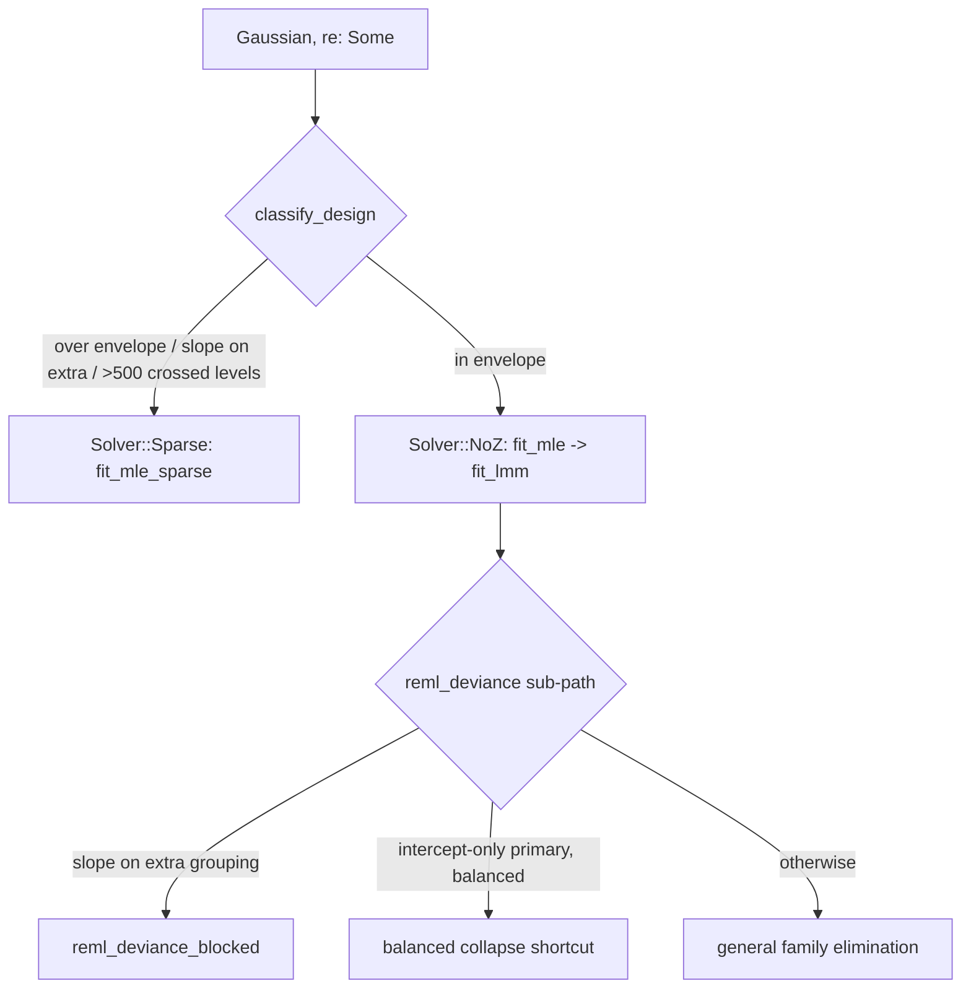

# LMM — Gaussian mixed models

This is the LMM page of the algorithm map — the path taken when
`ModelSpec.family == Family::Gaussian` and `re: Some(..)`. It documents only
what the code does today. For the dispatch overview, the knob index, and the
OLS/GLM paths, start at [`algorithms.md`](algorithms.md); for the family table
see [`supported_families.md`](supported_families.md). The page ends with a
[comparison](#how-the-other-engines-fit-an-lmm) against lme4 and
MixedModels.jl.

An LMM here is a Gaussian response with one or more grouping factors, each
carrying an intercept and optionally random slopes. Estimation is **REML only**
(there is no ML switch on this path — `src/fit/lmm.rs` hardcodes
`reml: true`): every objective below is the profiled REML deviance, so the
parity rungs are all fit `reml = true`. The fixed effects β and the residual
scale σ² are profiled out analytically; the optimiser sees only the relative
covariance parameter θ.

## Notation

The recurring symbols on this page, defined once here before first use:

- **θ** — the relative covariance parameter; the vector BOBYQA optimises. It is
  the `vech` of Λ stacked across grouping factors.
- **Λ = Λ(θ)** — the lower-triangular *relative* Cholesky factor of a grouping
  factor's random-effect covariance; "relative" means scaled by the residual
  variance σ². Each factor's absolute covariance is `σ²·ΛΛ′`.
- **`vech`** — the column-major stacking of a lower triangle into a vector; the
  `q(q+1)/2` entries that make up θ per factor.
- **q_p / q_g** — the random-effect width of the primary grouping / of an extra
  grouping (1 for intercept-only, 2 for intercept+slope, and so on).
- **β, σ²** — the fixed-effect coefficients and the residual variance; both are
  profiled out analytically, leaving the objective a function of θ alone.
- **N, P** — the row count and the fixed-effect count; `N − P` is the raw-row
  residual degrees of freedom.
- **V** — the marginal covariance of the response. The deviance is read off an
  augmented Cholesky rather than by forming V.

## Dispatch within the LMM path

Three real routing decisions sit between `fit_cold`/`fit_warm` and a returned
`Fit`:

1. **Solver class** — `classify_design` (`src/fit/mod.rs`) returns
   `Solver::NoZ` (dense, bounded stack scratch) or `Solver::Sparse` (heap
   sparse-Z). A design routes to `Sparse` iff it is over the dense envelope
   (`extra_groupings.len() > MAX_EXTRA_GROUPINGS`, primary width
   `q_p > MAX_PRIMARY_Q`, or any extra grouping width `q_g > MAX_EXTRA_Q` — the
   caps in `src/consts.rs`), **or** any extra grouping carries a random slope,
   **or** the total `Crossed` level count exceeds `MAX_CROSSED_LEVELS` (500).
   Otherwise `NoZ`.
2. **Kernel** — `NoZ` Gaussian goes to `fit_mle` (`src/fit/lmm.rs`) →
   `fit_lmm` (`src/lmm.rs`); `Sparse` Gaussian goes to `fit_mle_sparse`
   (`src/sparse/mod.rs`). Both minimise the same profiled-REML objective over
   the same θ seed/bounds; the sparse path is a superset that reproduces the
   dense fit to machine precision on any in-envelope design (see
   [the sparse section](#the-sparse-kernel-two-level-schur-block-cholesky)
   for why that equivalence is structural, not approximate).
3. **Deviance sub-path** (inside `fit_lmm`'s `reml_deviance`, `src/lmm.rs`) —
   extra-grouping random slopes route to `reml_deviance_blocked`; an
   intercept-only primary with a balanced level structure takes the
   closed-form collapse shortcut; everything else takes the general
   family-by-family elimination.



The blocked sub-path is a different, more expensive factorization, not a
variant of the general one. The general path
eliminates family-by-family and never materialises a joint RE system; the
**blocked** path builds the full `k_total × k_total` block-diagonal Λ
(component-scattered for the primary, contiguous per-level for nested/crossed
extras), forms the raw RE Gram `G = ZᵀZ`, and takes **one dense Cholesky** of
`P = ΛᵀGΛ + I` augmented with `[X y]` — `O(k_total³)` per evaluation, paid
only when an extra grouping carries a random slope.

**Code**: `classify_design` (`src/fit/mod.rs`); `fit_mle` (`src/fit/lmm.rs`);
`fit_lmm`, `reml_deviance`, `reml_deviance_blocked`,
`precompute_balanced_collapse` (`src/lmm.rs`); `fit_mle_sparse`,
`sparse_reml_deviance` (`src/sparse/mod.rs`); caps in `src/consts.rs`.
**Convention**: the NoZ/Sparse split is a scratch-capacity boundary, not a model
limit — lme4 and MixedModels.jl fit any of these designs with one solver; `glmm`
picks the faster kernel per shape and both give the same REML fit.
**Validation**: Dyestuff (rung 1, single intercept), sleepstudy (rung 2,
intercept+slope), Penicillin (rung 3, crossed), Pastes (rung 4, nested) exercise
the NoZ kernel; sim_slope_extra (rung 7, a slope-carrying crossed extra) is the
landed Gaussian rung that routes to `Sparse`.

## Covariance parameterization (θ-Cholesky)

Each grouping factor's `q×q` random-effect covariance is written `σ²·Λ(θ)Λ(θ)′`,
where Λ is the lower-triangular **relative** Cholesky factor — relative to the
residual scale σ², exactly lme4's `Λ_θ` convention. The optimiser works on θ, the
column-major `vech` of the lower triangle of Λ: `q(q+1)/2` entries per factor,
packed `[primary, extras in declaration order]`. For an intercept-only factor
(`q = 1`) θ is a single scalar (the relative standard deviation); a `q = 2`
slope factor contributes three entries (two diagonal, one off-diagonal
covariance), and so on.

Diagonal `vech` entries are the relative variances — they carry a start of
`THETA0 = 1.0` and a box `[0, THETA_HI]` with `THETA_HI = 1e3`. Off-diagonal
entries are signed covariances — they start at `0` with a symmetric box
`[−THETA_HI, THETA_HI]`.

After the fit, the absolute covariance is recovered per grouping factor by
`assemble_varcorr` (`src/fit/common.rs`): it walks the θ vector in
`[primary_q, extra_q…]` declaration order, unpacks each factor's Λ
(`primary_lambda`), and reports the `vech` of
`D[r][c] = σ̂²·Σ_{k ≤ min(r,c)} Λ[r][k]·Λ[c][k]` — i.e. `σ̂²·ΛΛ′` block by
block (`tau2 = θ²·σ̂²` in the scalar case).

**Code**: `LmmGroupings` (θ-layout: `n_theta`, `diagonal_theta`,
`blind_theta_and_bounds`), `primary_lambda`, constants `THETA0`/`THETA_HI`
(`src/lmm.rs`); `assemble_varcorr` (`src/fit/common.rs`). **Convention**: lme4's
relative Cholesky factor `Λ_θ`; θ is σ-relative, so σ² factors cleanly out of
the objective. **Validation**: the covariance recovery is checked by the varcomp
std-dev gate (relative ~1e-3) on sleepstudy (a full `2×2` Λ with a correlation),
Penicillin, and Pastes.

## Profiled REML objective

Given θ, β̂ and σ̂² are their closed-form REML solutions, so the objective is a
function of θ alone:

```
dev(θ) = log|V| + log|X'V⁻¹X| + (N − P)·log(σ̂²)
```

read directly off an augmented Cholesky rather than by forming the `N×N` marginal
covariance V. The kernel factors Ω_θ over the stacked
`[primary | nested children | crossed | X y]` system: `log|V|` comes from the
random-effect pivots (family blocks plus the crossed-tail diagonal),
`log|X'V⁻¹X|` from the trailing fixed-effect factor `L_XX`, and `(N − P)·log σ̂²`
from the residual entry `L[p,p]²` — no per-evaluation β backsolve. The scalar
Brent kernel (`profiled_deviance`, `src/lme.rs`) computes the byte-identical
normalisation, so the two agree to floating-point error rather than up to an
additive constant. `N − P` is the raw-row residual degrees of freedom.

**Prior weights.** With `FitOptions::weights`, the sufficient-statistics
accumulator (`LmmSuffStats::add_rows_multi`, `src/lmm.rs`) folds `√wᵢ` into
every accumulated quantity exactly once per side, so every Gram product carries
`wᵢ` — but the level counts and df stay raw-row (`n − p`). The weighted
Gaussian deviance needs one further θ-independent term, `−Σ log wᵢ`; because it
does not move the optimum, `fit_mle` (`src/fit/lmm.rs`) applies it to the
deviance (and recomputes the loglik) *after* optimization rather than paying it
per evaluation.

**Offset.** A `FitOptions::offset` is an exact response shift under the
identity link: `fit_mle` accumulates `y − o` and nothing downstream needs to
know (same convention as the OLS path).

The objective returns `f64::INFINITY` on any Cholesky failure or non-positive σ̂²
— that value is the deviance failure surface BOBYQA is driven over.

**Code**: `reml_deviance`, `reml_deviance_blocked`, `LmmSuffStats::add_rows_multi`
(`src/lmm.rs`); `fit_mle` (`src/fit/lmm.rs`); `sparse_reml_deviance`
(`src/sparse/mod.rs`); `profiled_deviance` (`src/lme.rs`).
**Convention**: lme4's profiled REML `devfun` — β and σ² profiled out, optimiser
on θ. **Validation**: the loglik gate is near-exact for LMM rungs (absolute
~1e-6 on the shared scale, ~1e-9 observed) across Dyestuff, sleepstudy,
Penicillin, Pastes; sim_slope_extra pins the sparse objective against the same
references.

## Closed-form single-intercept shortcut

The shortcut fires when the primary grouping is intercept-only (`q_p = 1`) and
its level structure is **balanced** — equal per-level row counts over an active
prefix. (This balanced shape is the one the grid-atom-snapped simulation designs
always produce.) In that case the family-by-family loop collapses to closed-form
arithmetic. `precompute_balanced_collapse` runs once per fit: it scans the
per-level counts for an equal-count active prefix starting at family 0, and
additionally requires the *nested-child* counts to match one common template
across the active families and to be exactly zero outside it — any hole in the
prefix silently disarms the collapse (`collapse_n_active = 0`) rather than
producing a wrong answer. When armed, it accumulates the θ-independent
cross-Grams `G_rr′` once; each θ-evaluation then replaces the per-family loop
with three cheap pieces: a single Crout of the common block `A(θ)`, an
`n_active·log|L|` term for the family log-determinant, and one θ-independent
Gram combine for the tail downdate. This reduces to the per-cluster
shrink-downdate arithmetic up to floating-point re-association, so the `q = 1`
corpus reproduces on this machine. Unbalanced counts, or any slope on the
primary, fall back to the loop.

A second, self-contained scalar kernel exists in `src/lme.rs`. `lme_fit` fits a
single random-intercept LMM by **Brent minimisation on `log(θ)`** (NR §10.3),
recovering β̂/σ̂²/Var(β̂) in closed form at θ̂. Brent runs to
`BRENT_REL_TOL = 1e-4`, capped at `MAX_BRENT_ITERS = 50`. Its bracketing has
several stages: with no start value it uses
the cold 3-point bracket `[LOG_THETA_LOW, LOG_THETA_MID, LOG_THETA_HIGH]`
(`LOG_THETA_LOW = ln(1e-4)`); a caller-supplied warm θ₀ gets a truth-centered
3-point bracket instead. A bracket that fails the down-up shape is repaired by
interior bisection and then up to two rounds of outward decade expansion, and a
truth bracket whose repair fails retries once from the cold bracket. A
left-edge failure is the τ̂≈0 boundary (`boundary_hit = 1`); a **right-edge**
(high-τ) failure is re-bracketed and retried once, and only then reported as
`boundary_hit = 2` — so in this kernel `boundary_hit = 2` covers both the
high-τ edge and genuine numerical failure (unlike `fit_lmm`, where 2 always
means failure/cap-out — see the boundary section). Its rank guard is a local
`EPS_RANK = 1e-8` (numerically identical to the `lmm.rs` copy) applied to the
pinning Cholesky after Brent converges.

This kernel is **not on the `fit_cold`/`fit_warm` path** — `mod lme` is
private, re-exported only through the unstable `loop_advanced` cargo feature,
which the MCPower hot loop consumes. The public surface routes every
single-intercept Gaussian LMM through `fit_lmm`'s collapse shortcut instead;
the two agree up to re-association.

**Code**: `precompute_balanced_collapse`, the `collapse` branch of `reml_deviance`
(`src/lmm.rs`); `lme_fit`, `profiled_deviance`, `brent_minimize`, constants
`BRENT_REL_TOL`/`LOG_THETA_LOW`/`MAX_BRENT_ITERS` (`src/lme.rs`). **Convention**:
lme4's single-scalar-θ profiled REML; Brent per NR (Press et al. 2007) §10.3.
**Validation**: Dyestuff (rung 1) is the single-intercept balanced rung; the
collapse and general paths are also cross-checked bit-for-bit by in-crate tests
(`src/lmm.rs` deviance-equivalence tests).

## General path: BOBYQA over θ

For everything the shortcut does not cover — slope primaries, unbalanced designs,
crossed and nested extras — `fit_lmm` minimises `reml_deviance` over the box-bounded
θ with **BOBYQA** (Powell 2009), a derivative-free trust-region method over an
interpolation set. `Bobyqa::new` is the only allocation site; `minimize` is
zero-alloc on the warm path.

The schedule set by `LmmWorkspace::for_cluster_spec_ext` (the shipped `fit_cold`
route) is:

| Parameter | Value | Source |
|---|---|---|
| `rho_begin` (initial trust radius) | `(0.1 · min diagonal θ₀).min(RHO_BEGIN)` → `0.1` at the cold blind start | `for_cluster_spec_ext` |
| `RHO_BEGIN` (cap) | `0.5` | `src/lmm.rs` |
| `rho_end` (final trust radius) | `RHO_END = 1e-6` | `src/lmm.rs` |
| `npt` (interpolation points) | `2·n_θ + 1` for `n_θ < 3`, else `⌈3·n_θ/2⌉ + 1` (`(3·n_θ).div_ceil(2) + 1`) | `for_cluster_spec_ext` |
| `max_fun` | PRIMA default `500·n_θ` | `Config::new` |

`rho_begin` is scaled to `0.1·θ₀` because the eval count is dominated by
trust-radius shrinkage, not travel distance. It is then capped at `0.5` so the
start `θ₀ = 1` stays clear of the `0` lower bound — PRIMA nudges any start that
lands within `rho_begin` of a bound. `RHO_END = 1e-6` was measured equivalent to
`1e-8` on every parity check under the crate's absolute floors, at ~25% fewer
evals. (The neighbouring constant `GLMM_RHO_END` in the same file is the GLMM
outer loop's own, separately-swept schedule — it never applies here.)

The `npt` mid-size (`⌈1.5n⌉+1`, used from `n ≥ 3`) beats Powell's `2n+1` on every
measured dimension ≥ 3; below that it *is* `2n+1`. PRIMA requires
`n+2 ≤ npt ≤ (n+1)(n+2)/2`, which the formula respects.

Two alternate seeds exist alongside the shipped schedule. `bobyqa_config` is a
generic default without the scaled schedule (`RHO_BEGIN`, PRIMA default
`npt = 2n+1`). `sparse_lmm_seed` is the sparse path's byte-identical,
topology-only seed (it computes the identical `npt` formula from the spec
alone).

The dev-only env campaign hooks are no-ops unless set, and are not part of the
shipped behaviour. `LMM_NPT_FORMULA` and `LMM_MAX_FUN_FORMULA` override single
numeric knobs. `LMM_TWO_STAGE` switches the **dense LMM kernel only** to a
different optimizer shape: `two_stage_minimize`, a stage-1 `npt = n+2`,
`rho_end = 1e-3` scout that warm-restarts a stage-2 `npt = 2n+1` polish
(`fit_mle_sparse` never calls it). `LMM_STAGE_PROBE` emits per-stage eval
diagnostics from that same dense path.

**Code**: `fit_lmm`/`fit_lmm_impl`, `LmmWorkspace::for_cluster_spec_ext`,
`bobyqa_config`, `sparse_lmm_seed`, constants `RHO_BEGIN`/`RHO_END`/`THETA0`
(`src/lmm.rs`); the external `bobyqa` crate supplies the solver.
**Convention**: derivative-free BOBYQA over relative-Cholesky θ, as in lme4's
default `nloptwrap`/`bobyqa` optimiser for `lmer`. **Validation**: sleepstudy
(`n_θ = 3`, correlated slope), Penicillin (crossed), Pastes (nested) drive the
general elimination; sim_slope_extra drives the sparse variant. The tuning
constants were swept against the parity corpus (27 manifest datasets, rungs
1–23 and 25–28, all green; rung 24 backed out).

## Boundary handling (PIN_THETA)

A singular fit — a variance component collapsing to zero — presents as a diagonal
θ entry driven to the lower bound. After BOBYQA converges, `fit_lmm` applies a
deterministic per-component pin: every **diagonal** variance component `≤
PIN_THETA (1e-4)` is set to exactly `0.0`, the fit is still counted as converged,
and the component's bit is recorded in `pinned_components`. Off-diagonal
covariances are never pinned — a correlation running to `±1` shows up as the
*diagonal* `λ_dd → 0` under the Cholesky parameterization, so pinning the
diagonal is the complete policy. `PIN_THETA = 1e-4` aligns the class boundary with
the scalar Brent kernel's τ̂≈0 detection. The `Fit.singular` flag is set when any
component was pinned (`boundary_hit == 1`) **or** by the post-hoc
`has_negligible_component()` check at `Fit` assembly (`src/fit/mod.rs`,
`SINGULAR_REL_TOL = 1e-3`): any RE standard deviation `≤ 1e-3 ×` the largest —
a relative check that catches scale-degenerate fits the absolute θ pin misses.
The sparse path applies the identical pin, and the GLMM path mirrors the whole
policy after its stage-2 BOBYQA
([`algorithms-glmm.md` §Boundary handling](algorithms-glmm.md#boundary-handling-and-the-singular-flag)
— change together).

A truth-seeded warm start is clamped to `THETA_TRUTH_FLOOR = 0.01` first, so a
near-zero true θ never begins the search on the boundary itself.

Distinct from a pin, the failure/cap-out outcomes (`boundary_hit == 2`) split
into two cases — the **plateau policy**, pinned by
`maxfun_cap_reports_honest_endpoint` (`src/lmm.rs`):

- A `MaxFunReached` cap-out whose endpoint passes the `EPS_RANK = 1e-8` rank
  guard runs the full β̂/σ̂²/SE recovery and returns **real finite numbers**
  with `converged: false` — the best point found is reported rather than
  discarded. (When BOBYQA hits `max_fun` on a flat deviance plateau, that
  point is usually close to the optimum.)
- `ModelDegenerate` (no accepted endpoint), or an endpoint whose `p×p` factor
  fails the rank guard, yields the NaN-filled, non-converged fit.

The sparse path mirrors the same plateau policy. Note the code-point overlap
with the scalar Brent kernel: in `fit_lmm`, `boundary_hit == 2` always means
failure or cap-out; in `lme_fit` it can also mean the high-τ right edge of the
Brent bracket (see the shortcut section) — the two kernels share the code's
numeric values but not their exact semantics.

**Code**: the pin loop and endpoint recovery in `fit_lmm_impl`, constants
`PIN_THETA`/`THETA_TRUTH_FLOOR`/`EPS_RANK` (`src/lmm.rs`); the mirror pin and
plateau policy in `fit_mle_sparse` (`src/sparse/mod.rs`). **Convention**:
lme4 reports such fits as `isSingular`; `glmm` pins to exactly `0` (FP-stable
across platforms) and still returns the fit. **Validation**: Dyestuff sits near
the interior; the boundary behaviour is pinned by in-crate τ̂≈0 tests
(`src/lmm.rs`) that assert `boundary_hit == 1` and `θ̂ == 0.0`, the plateau
policy by `maxfun_cap_reports_honest_endpoint`, and the singular-fit handling
by the reference engines flagging the same data.

## The sparse kernel: two-level Schur-block Cholesky

`fit_mle_sparse` (`src/sparse/mod.rs`) minimises the same objective but
factorises a differently-shaped system, in an elimination order chosen for
sparse Z. Per θ-evaluation, `sparse_schur_factor` runs:

1. **Family blocks** — a per-family `w×w` Crout for `L11`, whose pivots
   accumulate `log|L_ZZ|²`;
2. **Coupling** — per-family `e×w` triangular solves for `L21`;
3. **Schur tail** — the downdate `S22 = A22 − L21·L21ᵀ`, then an LLT of `S22`
   that is itself dense-or-sparse: past the `TAIL_SPARSE_MIN` threshold it
   switches to fill-reducing compact panels and faer's AMD sparse LLT — the
   same analyze-once/factorize-per-eval split CHOLMOD gives lme4;
4. **Fixed tail** — a forward-solve-only `U = L⁻¹B` (never backsolved — the
   deviance and recovery need only `BᵀA⁻¹B = UᵀU`), and a final Crout of
   `S = C_xy − UᵀU` into the augmented `[X y]` factor.

The dense-equivalence claim from the dispatch section is structural: at the
same θ both kernels factor the same SPD system, and by
Cholesky uniqueness the sparse factor equals the dense path's augmented factor
— so the two fits agree to machine precision wherever both apply, and the
sparse path can serve as the superset solver without a separate tolerance.

**Code**: `fit_mle_sparse`, `sparse_reml_deviance`, `sparse_schur_factor`,
`schur_phase_b`, `TAIL_SPARSE_MIN` (`src/sparse/mod.rs`). **Validation**:
sim_slope_extra (rung 7) externally; the dense-vs-sparse deviance equivalence
by in-crate cross-checks.

## Standard errors

The LMM standard error is the profiled REML SE — one method, not the
Hessian/Rx split that the GLMM path carries (`Fit.stddev_se` is empty for an LMM,
and `FitOptions::wald_se` is ignored here). At θ̂, `Var(β̂_j) = σ̂²·‖L_XX⁻¹ e_j‖²`
from a forward solve against the fixed-effect Cholesky factor, and the squared
Wald statistic is `t² = β̂_j² / Var(β̂_j)`. SEs are computed only for the columns in
`FitOptions::target_indices`. A joint Wald χ² over the target set is available via
the shared `joint_wald_chi_sq` helper (re-Choleskying `X'V⁻¹X = L_XX·L_XXᵀ`).

**Code**: the recovery block in `fit_lmm_impl` (`src/lmm.rs`),
`joint_wald_chi_sq` (`src/lme.rs`, promoted `pub(crate)`). **Convention**:
lme4's profiled fixed-effect covariance `σ̂²·(X'V⁻¹X)⁻¹`; all engines compute
the LMM SE identically. **Validation**: the LMM `se` gate is tight (~1e-3)
across Dyestuff, sleepstudy, Penicillin, Pastes against both lme4 and
MixedModels.jl.

## Validation

The parity harness (`parity/`) fits the same model on the same CSV with lme4,
MixedModels.jl, and `glmm`, and gates β and varcomp std-devs at relative ~1e-3,
the LMM `se` at ~1e-3, and the REML loglik at absolute ~1e-6. The committed data
plus the reference JSONs are the frozen oracle: on any disagreement `glmm` is
presumed wrong. The manifest currently carries 27 datasets (rungs 1–23 and
25–28; rung 24, the sparse Gamma, is backed out). The core Gaussian LMM rungs:

| Rung | Dataset | Structure | Path exercised |
|---|---|---|---|
| 1 | Dyestuff | single random intercept | NoZ, balanced-collapse shortcut |
| 2 | sleepstudy | intercept + correlated slope (`q_p = 2`) | NoZ, general elimination |
| 3 | Penicillin | crossed factors | NoZ, crossed tail |
| 4 | Pastes | nested factor | NoZ, nested family block |
| 7 | sim_slope_extra | slope-carrying crossed extra | Sparse (`fit_mle_sparse`) |

Further Gaussian rungs in the corpus (Machines `q = 3`, Oats real nesting, cake
interaction grouping, sim_three_level, sim_max_q_slope at the `q = 8`
`MAX_PRIMARY_Q` boundary, sim_unbalanced_nested, sim_nested_crossed_mix) are
landed and green — they exercise the same kernels through the same gates.

## How the other engines fit an LMM

All three engines that fit LMMs share Doug Bates' formulation: the relative
Cholesky `Λ_θ`, the profiled deviance with β and σ² eliminated analytically,
and a derivative-free optimiser over θ alone. The differences are defaults and
linear algebra, not objective. (GLMMadaptive does not appear on this page — it
targets non-Gaussian GLMMs and defers Gaussian LMMs to nlme/lme4.)

| | lme4 (`lmer`) | MixedModels.jl | `glmm` |
|---|---|---|---|
| Criterion default | REML (ML switch) | **ML** (REML switch) | **REML, locked** — no switch |
| Optimiser | BOBYQA via nloptwrap (default) | BOBYQA via NLopt | BOBYQA (PRIMA), tuned `npt`/ρ schedule; Brent for the `loop_advanced` scalar kernel |
| Linear algebra per eval | sparse Cholesky of `ΛᵀZᵀZΛ + I` (CHOLMOD), Z materialised | blocked/amalgamated Cholesky, Z materialised | dense path: **no Z at all** — sufficient statistics + family-block elimination, with a closed-form collapse for balanced single-intercept designs; sparse path: Schur-block Cholesky (AMD sparse tail) |
| Singular fit | fits, `isSingular` warns | fits, flags | pins diagonal components ≤ `1e-4` to exact `0`, still `converged`, sets `singular`/`pinned_components` |
| Optimiser cap-out | warns, returns last point | warns, returns last point | returns the best finite point, `converged: false`, `boundary_hit = 2` |
| BLUPs / `ranef` | yes | yes | not computed (deliberate — see [`coming-from-lme4.md`](coming-from-lme4.md)) |

The rows that matter in practice: the **criterion lock** (comparing `glmm` to
MixedModels.jl at defaults differs by REML-vs-ML variance-component bias, not
by a bug — set `REML=true` on the Julia side to match), and the
**singular-fit reporting** (the information lme4 puts in a warning, `glmm`
puts in flags a caller must read; the estimate itself is the same pinned-zero
fit all engines return). The no-Z sufficient-statistics evaluation is why
refit loops are cheap: each dense θ-evaluation works on per-cluster Grams, so
its cost scales with the cluster count rather than the row count. The full
list of differences from the other engines, with justification, is in
[`glmm-design.md`](glmm-design.md).

## References

- Bates, D., Mächler, M., Bolker, B. & Walker, S. (2015). Fitting Linear
  Mixed-Effects Models Using lme4. *Journal of Statistical Software*, 67(1),
  1–48. — the relative-Cholesky `Λ_θ` parameterization, the profiled REML
  objective, and the singular-fit conventions this page follows.
- Bates, D. et al. *MixedModels.jl* (Julia package). — the second reference
  engine; same profiled objective, ML default, BOBYQA.
- Powell, M. J. D. (2009). *The BOBYQA algorithm for bound constrained
  optimization without derivatives*. Report DAMTP 2009/NA06, University of
  Cambridge. — the θ optimizer; the `npt` bounds cited in the schedule table
  are Powell's.
- Press, W. H., Teukolsky, S. A., Vetterling, W. T. & Flannery, B. P. (2007).
  *Numerical Recipes* (3rd ed.), §10.3. Cambridge University Press. — the Brent
  minimizer in the `loop_advanced` scalar kernel (`lme_fit`).
