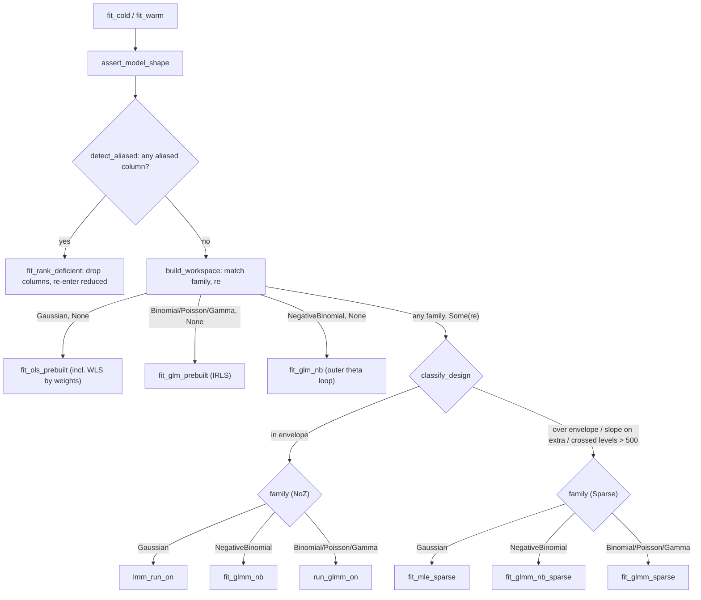

# Algorithm map — dispatch, knobs, OLS & GLM

This is the entry point of the `glmm` algorithm map. It documents, strictly as
built, how a call to `fit_cold`/`fit_warm` reaches a terminal solver, indexes
every tuning knob, and covers the two fixed-effect-only paths (OLS and GLM). The
mixed-model leaves get their own pages:

- [`algorithms-lmm.md`](algorithms-lmm.md) — Gaussian mixed models (LMM).
- [`algorithms-glmm.md`](algorithms-glmm.md) — non-Gaussian mixed models (GLMM).

Family and link coverage is tabled in
[`supported_families.md`](supported_families.md). Each page ends with a
comparison against lme4, MixedModels.jl, and (on the GLMM page) GLMMadaptive;
[`glmm-design.md`](glmm-design.md) summarises the algorithmic differences from
the other engines and the reasoning behind them.

## Full dispatch map

Every real fit enters through `fit_warm` (`fit_cold` is exactly
`fit_warm(.., None, ..)`). It shape-checks the inputs (`assert_model_shape`,
followed by the finiteness/shape asserts on `weights`, `offset`, and any
`StartValues`), runs the rank-deficiency salvage, sizes the spec from the group
ids, then hands off to the unified fit core in `src/fit/core.rs`:
`build_workspace` matches on `(family, re)` — the mixed arm routing through
`classify_design` to a dense (`NoZ`) or sparse (`Sparse`) solver, and within
each solver the family selecting the kernel — and `fit_on` solves on the
workspace it allocated. This is the whole as-built decision tree — one graph, no
unreachable arms.

The core is the *only* dispatch body. `fit_warm` allocates a throwaway
workspace per call and always assembles the full `Fit`; a `loop_advanced`
caller builds once per shape and reads the lean `FitView` per draw. Both walk
the identical tree, so routing cannot drift between the two tiers. The
`orchestrate` feature (`src/orchestrate.rs`, off by default, no semver
guarantee) is a third caller and not a fourth tier: it lowers a formula and a
data table, calls `fit_warm`, and flattens the result for the Python and R
packages, so it enters the tree at the same door `fit_warm` does.

**Rank-deficiency salvage.** Before any solver runs, `detect_aliased` forms the
lower-triangular Gram `XᵀX` and rank-reveals it (`ols::aliased_columns`, drop
tolerance `ALIAS_EPS = 1e-14`); if any fixed column is aliased on an earlier one,
`fit_rank_deficient` drops those columns, fits the reduced full-rank model
through a recursive `fit_warm`, and scatters β/SE back to full width with the
dropped slots left `NaN` (lme4's `NA`-coefficient behaviour — the fit still
converges). The rank reveal is deliberately **left-to-right with no pivoting**,
matching R/lme4's `dqrdc2` convention: of a collinear pair, the *later* column
is always the one dropped, regardless of magnitude (the per-column pivot test
`piv ≤ eps·G_dd` is scale-invariant), so the `NaN` slots land exactly where
lme4 puts its `NA`s. The reduced design is full rank, so the recursion never
re-enters this branch. An aliased column that is also an RE slope is faulted
rather than mis-indexed. This preprocessing is path-agnostic: it serves OLS,
GLM, LMM and GLMM alike.

**`classify_design` routing (mixed arm only).** A mixed design routes to
`Solver::Sparse` when it is over the dense envelope (primary width
`q_p > MAX_PRIMARY_Q`, more than `MAX_EXTRA_GROUPINGS` extra groupings, or any
extra grouping width `1 + slopes.len() > MAX_EXTRA_Q`), **or** any extra
grouping carries a random slope, **or** the total `Crossed` level count exceeds
`MAX_CROSSED_LEVELS`; otherwise it stays `Solver::NoZ`. The caps are a
scratch-capacity boundary, not a model limit — the router redirects rather than
aborts, so every wired family fits on whichever side it lands and there is **no
reachable `unimplemented!` / panic** in the mixed dispatch. Two of the clauses
have non-obvious reasons:

- *Slope-carrying extras always go Sparse* for two independent reasons. On the
  Gaussian side it is a measured performance crossover (the sparse kernel won
  4–13× on the 2026-07-02 sweep). On the non-Gaussian side it is the only
  implementation: the dense GLMM kernel's `build_z` emits intercept-only
  columns for extra groupings, so a dense slope-on-extra path does not exist.
- *`MAX_CROSSED_LEVELS` (500) is a performance boundary, not a scratch
  ceiling*: the dense crossed tail is cubic in the total crossed column count
  (a measured 22,714-level crossed factor cost ~10¹³ flops and ~6 GB of
  scratch per deviance eval), while at 500 levels the cubic term is
  negligible. The other three caps size stack buffers and are hard.

The one hard rejection is a shape assert: `assert_model_shape` still panics on
true invariant violations (a bad `nagq`, an out-of-range slope column, more
than one nested grouping). The level-count clause reads real
`Crossed { n_clusters }`, so the entry sizes the spec from the row ids
(`spec_sized_from_ids`) before classifying.

**Code:** `fit_warm`/`fit_cold`, `Solver`, `FitOptions` (`src/fit/mod.rs`);
`detect_aliased`, `fit_rank_deficient`, `assert_model_shape`,
`spec_sized_from_ids` (`src/fit/common.rs`); `aliased_columns`, `ALIAS_EPS`
(`src/ols.rs`); envelope caps in `src/consts.rs`. **Convention:** lme4's
rank-deficiency handling (drop aliased columns, `NA` coefficient, still
converge); the `NoZ`/`Sparse` split is a per-shape kernel choice invisible to
the model — both target the identical lme4/MixedModels.jl optimum.
**Validation:** the salvage is pinned by
`fit_rank_deficient_drops_and_matches_reduced` (`src/fit/common_tests.rs`); the
routing boundary and both solver arms are pinned across the mixed corpus — see
the LMM and GLMM pages for the per-kernel rungs (Dyestuff, sleepstudy,
Penicillin, Pastes, sim_slope_extra on the Gaussian side; cbpp, grouseticks,
`sim_sparse_binomial`, `sim_sparse_poisson` on the non-Gaussian side).

## Legend

- **Node** = a named function the dispatch actually calls; the terminal leaves
  (`fit_ols_prebuilt`, `fit_glm_prebuilt`, `fit_glm_nb`, `lmm_run_on`,
  `run_glmm_on`, `fit_glmm_nb`, and the three `*_sparse` twins) are the solvers.
  **Diamond** = a real branch in the code (`match`, `classify_design`, a guard).
  **Edge label** = the condition under which that branch is taken.
- **Code citations** across all three pages use the form `src/path/file.rs` plus
  the item name (fn/struct/const) — never line numbers, so a citation survives
  edits to the file. When an item name is unique in the crate the file alone
  locates it. (The `fit` and `sparse` modules are directories: the entry and its
  preprocessing live in `src/fit/mod.rs` and `src/fit/common.rs`, the dispatch
  itself in `src/fit/core.rs`, the per-path entry points in
  `src/fit/{ols,glm,lmm,glmm}.rs`, their tests in the sibling `*_tests.rs`
  files, and the sparse solver in `src/sparse/`.)
- The map grows with the crate: future optimizer tiers and additional families
  will add leaves and edges, but this document tracks only what ships today.

## Knob index

Every tuning surface, one line each, pointing at the page that owns it. Public
`FitOptions` knobs are documented at their use site; internal constants are
tuned on the crate's validation corpus (27 manifest datasets, rungs 1–23 and 25–28;
rung 24, the sparse Gamma, is backed out — see the LMM/GLMM validation sections)
and are not user-facing.

### Public `FitOptions` fields (`src/fit/mod.rs`, `struct FitOptions`)

| Knob | Meaning | Owned by |
|---|---|---|
| `target_indices` | fixed-effect columns to compute SE for | [OLS](#ordinary-least-squares-ols) / [GLM](#generalised-linear-models-glm) here; LMM SE in [`algorithms-lmm.md`](algorithms-lmm.md#standard-errors); GLMM SE in [`algorithms-glmm.md`](algorithms-glmm.md#standard-errors) |
| `wald_se` | `Hessian` (default) vs `Rx` Wald covariance | GLMM only — [`algorithms-glmm.md`](algorithms-glmm.md#standard-errors) (ignored on OLS/GLM/LMM) |
| `nagq` | AGQ node count, default 1 (Laplace) | GLMM only — [`algorithms-glmm.md`](algorithms-glmm.md#adaptive-gausshermite-quadrature-agq) |
| `dispersion` | Gamma φ directive: `None` estimates, `Some(v)` fixes | [GLM Gamma](#generalised-linear-models-glm) here; Gamma GLMM in [`algorithms-glmm.md`](algorithms-glmm.md#laplace-approximation) |
| `weights` | per-row prior (case) weights `wᵢ` | every path — [OLS](#ordinary-least-squares-ols)/[GLM](#generalised-linear-models-glm) here, mixed paths in the LMM/GLMM pages, **including** AGQ (`nagq > 1`) on the binomial/Poisson shapes AGQ covers |
| `offset` | per-row offset `oᵢ` added to the linear predictor | every path — [OLS](#ordinary-least-squares-ols)/[GLM](#generalised-linear-models-glm) here, mixed paths in the LMM/GLMM pages |
| `parallel_inner` | experimental opt-in to parallel inner kernels | GLMM only — AGQ/FD-Hessian, [`algorithms-glmm.md`](algorithms-glmm.md#standard-errors) (off by default, bit-identical to serial) |

### Internal tuning constants

| Knob | Value / formula | Owned by |
|---|---|---|
| BOBYQA `npt` | `2·n_θ + 1` for `n_θ < 3`, else `(3·n_θ).div_ceil(2) + 1` | [`algorithms-lmm.md`](algorithms-lmm.md#general-path-bobyqa-over-θ) (`src/lmm.rs`) |
| `rho_begin` schedule | `(0.1·min diag θ₀).min(RHO_BEGIN)`, `RHO_BEGIN = 0.5` | [`algorithms-lmm.md`](algorithms-lmm.md#general-path-bobyqa-over-θ) (`src/lmm.rs`) |
| `rho_end` | `RHO_END = 1e-6` | [`algorithms-lmm.md`](algorithms-lmm.md#general-path-bobyqa-over-θ) (`src/lmm.rs`) |
| `PIN_THETA` | `1e-4` — diagonal variance component pinned to `0` | [`algorithms-lmm.md`](algorithms-lmm.md#boundary-handling-pin_theta) (`src/lmm.rs`) |
| `SINGULAR_REL_TOL` | `1e-3` — post-hoc relative check: any RE stddev `≤ 1e-3 ×` the largest ⇒ `singular` | [`algorithms-lmm.md`](algorithms-lmm.md#boundary-handling-pin_theta) (`src/fit/mod.rs`) |
| `two_stage` warm-start gate | disabled when `n_θ ≤ 2 && p ≤ 4`, else enabled | [`algorithms-glmm.md`](algorithms-glmm.md#β-profiling--the-two-stage-optimizer) (`src/glmm/workspace.rs`) |
| `ETA_DIVERGENCE_CAP` | `30` — GLM divergence guard: any `|η_i| > 30` at IRLS iter ≥ 3 → non-converged; skipped under the Gamma inverse link | [GLM](#generalised-linear-models-glm) (`src/glm.rs`) |
| `SATURATION_W` / `SATURATION_FRAC` | `1e-5` / `0.5` — post-fit separation guard: > half the (weighted) rows saturated → non-converged | [GLM](#generalised-linear-models-glm) (`src/glm.rs`) |
| `MAX_PRIMARY_Q` | `8` — primary width cap (over → Sparse) | [dispatch](#full-dispatch-map) (`src/consts.rs`) |
| `MAX_EXTRA_Q` | `4` — per-extra-grouping width cap | [dispatch](#full-dispatch-map) (`src/consts.rs`) |
| `MAX_EXTRA_GROUPINGS` | `6` — extra-grouping count cap | [dispatch](#full-dispatch-map) (`src/consts.rs`) |
| `MAX_THETA` | derived θ-length ceiling: `vech(Λ_p)` + one `vech(Λ_g)` block per extra = `8·9/2 + 6·(4·5/2) = 96` | [dispatch](#full-dispatch-map) (`src/consts.rs`) — sizes every θ-length stack buffer |
| `MAX_CROSSED_LEVELS` | `500` — total crossed-level cap (over → Sparse; a performance boundary, not scratch) | [dispatch](#full-dispatch-map) (`src/consts.rs`) |
| `MAX_NAGQ` | `25` — largest odd AGQ order the GH table stores | [`algorithms-glmm.md`](algorithms-glmm.md#adaptive-gausshermite-quadrature-agq) (`src/consts.rs`) |

The NB GLM outer-loop constants (`NB_MAX_OUTER = 25`, `NB_THETA_TOL = 1e-6`,
`NB_THETA_LO = 1e-3`, `NB_THETA_HI = 1e4`) are covered in the
[GLM section](#generalised-linear-models-glm) below; the GLMM NB path reuses the
same bracket through a global golden-section search
([`algorithms-glmm.md`](algorithms-glmm.md#negative-binomial-outer-θ-loop)).

## Ordinary least squares (OLS)

**Code:** `fit_ols_prebuilt` + `ols_view_to_fit` (`src/fit/ols.rs`);
`OlsSuffStats::add_rows`,
`fit_suff_stats_t_sq`, `PANEL_ROWS` (`src/ols.rs`). **Convention:** the textbook
Gaussian OLS normal equations, with R `lm()`'s residual-df and dispersion
conventions. **Validation:** `fit_ols_recovers_slope`, and for the weighted path
`fit_ols_weighted_matches_r_lm` / `fit_ols_constant_weights_invariant`
(`src/fit/ols_tests.rs`). OLS is the fixed-only Gaussian leaf and is not a
dedicated mixed-model validation rung; it is exercised implicitly as the `q_p = 1`
degenerate of the LMM kernels.

`fit_ols_prebuilt` accumulates the sufficient statistics `XᵀX` (lower triangle), `Xᵀy`,
and `yᵀy` in a single panel-blocked pass (`OlsSuffStats::add_rows`, repacking
`PANEL_ROWS = 256`-row panels so the GEMM stays cache-resident), then solves the
normal equations by a Cholesky of `XᵀX`: `L z = Xᵀy`, `Lᵀ β̂ = z`
(`fit_suff_stats_t_sq`). The residual sum of squares is the closed form
`RSS = yᵀy − β̂ᵀXᵀy` — no residual sweep. The dispersion is
`σ̂² = RSS/(n − p)` with **raw-row** residual df `n − p`, and the SE of a target
column is `√(σ̂²·‖L⁻¹e_j‖²)` from one forward solve against the Cholesky factor
(the diagonal of `σ̂²(XᵀX)⁻¹`). Only a genuine Cholesky failure (non-PD factor)
returns a non-converged, `NaN`-filled fit; a near-singular but PD factor is
fitted, and its scale-invariant pivot ratio (`min_pivot_ratio`) is measured
and, below `PIVOT_MIN = 1e-12`, recorded as an `IllConditioned` note on
`Fit::diagnostics` rather than refused. `fit_suff_stats_t_sq` no longer takes
an `eps_rank` parameter. `Fit::dispersion` carries `σ̂²` on this path (`NaN` on
any non-converged return); `Fit::deviance` is **always** `NaN` on the OLS
path — it is never populated, converged or not.

**Offset.** A `FitOptions::offset` is applied as an exact response pre-shift:
the accumulator sees `y − o`, applied *before* any weight scaling so the two
compose correctly. (The GLM path below handles its offset differently — inside
η each iteration.)

**WLS by row scaling.** Prior weights (`FitOptions::weights`) are applied as
`√wᵢ` row pre-scaling of both `X` and `y` before the unit-weight accumulator
runs, so the Grams become `XᵀWX`, `XᵀWy`, `yᵀWy`; then `RSS = yᵀWy − β̂ᵀXᵀWy`
is the weighted RSS and `σ̂² = RSS/(n − p)` keeps the raw-row df, matching
R `lm(weights=)`. Constant weights leave the fit invariant. Two of the
accumulator's by-products (`sum_y`, `sst`) are not weight-consistent under this
scaling; they are deliberately never mapped into `Fit`.

## Generalised linear models (GLM)

**Code:** `fit_glm_prebuilt` + `glm_view_to_fit` and (for negative binomial)
`fit_glm_nb` (`src/fit/glm.rs`);
the IRLS kernel `glm_irls_fit` with its constants `MAX_IRLS_ITERS = 50`,
`DEVIANCE_TOL = 1e-8`, `WEIGHT_CLAMP = 1e-6`, `ETA_DIVERGENCE_CAP = 30`,
`SATURATION_W = 1e-5`, `SATURATION_FRAC = 0.5` (`src/glm.rs`); the SIMD
transcendental fast paths in `src/simd_transcendental.rs`; per-family link,
variance and deviance in `src/family.rs`. **Convention:** McCullagh & Nelder
IRLS with the canonical working response and prior-weight sense; R `glm()`'s
deviance and dispersion, and `MASS::glm.nb` for the NB θ profile.
**Validation:** the weighted goldens `fit_glm_gamma_weighted_matches_r`,
`fit_glm_binomial_weighted_aggregated_matches_r` (`src/fit/glm_tests.rs`),
`glm_weighted_deviance_null_golden_value` (`src/glm.rs`), and for NB
`fit_glm_nb_matches_mass` / `fit_glm_nb_weighted_matches_mass`
(`src/fit/glm_tests.rs`). GLM is a fixed-only leaf with no external three-way
validation rung of its own; the cbpp/grouseticks rungs exercise the same family
math through the GLMM cold-start GLM fit.

`fit_glm_prebuilt` runs adaptive IRLS cold-started at β = 0, converging on
`|Δ deviance| < DEVIANCE_TOL` with a `MAX_IRLS_ITERS` safety cap. The η seed at
that β = 0 start is **family-specific** — a plain η = 0 start is wrong for two
of the regimes:

- **Logit/probit binomial:** η = 0 (μ = ½), the standard start.
- **Gamma with the inverse link:** η = 0 is singular under `g(μ) = 1/μ`, so
  each row seeds `η = 1/clamp(yᵢ)` (R's `etastart = 1/y` convention), where
  `clamp` floors the response at `MU_FLOOR = 1e-10` so a zero/negative row
  cannot produce an infinite or negative seed.
- **Log-link count families (Poisson, NB):** each row seeds the null model,
  `η = ln(ȳ + 0.1)`. A plain η = 0 start (μ = 1) overshoots so badly on
  high-mean counts (`ȳ ≳ 25–30`) that IRLS diverges past the
  `ETA_DIVERGENCE_CAP` guard.

The `family` argument selects the arithmetic in two branches:

- **Canonical fused-SIMD path** — `Family::Binomial { link: Logit }` (unweighted)
  runs a verbatim fused kernel (`pw_and_log1pexp_sum`,
  `src/simd_transcendental.rs`) that computes the probability `p`, the working
  weight `W`, and the `Σ log1pexp(η)` deviance fold in one vectorised pass,
  sharing a single `exp(−|η|)` evaluation between the probability and the
  deviance term. The transcendentals are the crate's own minimax polynomials
  (Cody–Waite range reduction, degree-11 `exp`, degree-9 `log1p`; ≤ 2 ULP
  against libm), with a SIMD body plus a bit-identical scalar tail. On native
  targets the kernel fuses with hardware FMA; on `wasm32` it compiles to plain
  mul/add, because wasm SIMD has no FMA and the soft-float libcall fallback
  measured 9–41× slower. This is the MCPower hot path, kept byte-identical.
- **General Fisher-scoring branch** — every other family (Poisson, Gamma, NB,
  probit binomial, and *weighted* logit) routes the scalar arm, reading its link
  inverse, variance, and deviance residual from `src/family.rs`. Prior weights
  multiply the working weight (`(wᵢ·W_raw).max(WEIGHT_CLAMP)`) and the deviance
  contribution; a weighted logit therefore leaves the fused path for the scalar
  arm (the fused kernel has no per-row weight slot).

**Offset.** With `FitOptions::offset`, the linear predictor is `η = o + Xβ`
throughout; each IRLS iteration solves the weighted normal equations against
the shifted working response `z − o`, so β never absorbs the offset.

**Guards beyond the deviance fixpoint.** Four additional exits protect the
loop, all in `glm_irls_fit`:

- A **divergence guard**: any `|η_i| > ETA_DIVERGENCE_CAP (30)` at iteration ≥ 3
  marks the fit non-converged immediately. The bound is on the linear predictor,
  where |η| = 30 is already probability ≈ 1 − 1e-13 — out there is separation,
  not signal. Bounding η rather than β is what makes the decision independent of
  the caller's units: rescaling a predictor column divides its coefficient by
  the same factor and leaves η, the fitted values and the deviance untouched, so
  a bound on `|β_j|` would accept or reject the same model depending on whether
  a height column is in metres or kilometres. The guard is skipped for
  `Family::Gamma { link: Inverse }`, where η = 1/μ and a small-mean fit carries a
  large |η| honestly; that arm exits through `clamp_eta`'s ±700, the non-finite
  guard, or `MAX_IRLS_ITERS` instead.
- A **degenerate-response short-circuit**: an all-0 or all-1 (weighted)
  Bernoulli response returns early rather than dividing by zero in the working
  response.
- A **post-fit saturation guard**: after the deviance fixpoint is reached, if
  more than `SATURATION_FRAC` (half) of the prior-weight mass sits on rows
  with working weight below `SATURATION_W = 1e-5` (fitted probabilities pinned
  at 0/1 — quasi-separation), the fit is flipped to non-converged even though
  the deviance converged.
- A **Cholesky failure** on `XᵀWX` (non-PD) → non-converged.

There is deliberately **no step-halving** on this path: the trial β is accepted
unconditionally each iteration, matching R's un-halved IRLS trajectory. (The
mixed PIRLS loop *does* step-halve, because there it mirrors lme4 — see
[`algorithms-glmm.md`](algorithms-glmm.md#pirls-inner-loop).)

**Dispersion.** Binomial and Poisson hold `φ ≡ 1`, so `(XᵀWX)⁻¹` is the full
covariance. **Gamma** recovers `φ` post-fit: the mean model is φ-independent, so
φ stays out of the IRLS, and either `FitOptions::dispersion = Some(v)` fixes it
or `None` estimates the Pearson moment `φ̂ = Σ wᵢrᵢ²/(n − p)` (Pearson residual
`rᵢ = (yᵢ − μ̂ᵢ)/√V(μ̂ᵢ)`, raw-row df) — matching
`summary(glm(family=Gamma))$dispersion`; the SE is then scaled by `√φ̂`. One
subtlety: Gamma's `Fit::loglik` is built from `family::gamma_aic`, which
profiles its *own* dispersion as `D/Σwᵢ` — a different estimate from the
Pearson `φ̂` that scales the SE. R mixes the same two conventions between
`logLik()` and `summary()`, and `glmm` matches R on both; `Fit::loglik`
therefore cannot be reconstructed from `Fit::dispersion`.

**Negative-binomial outer θ-loop.** `fit_glm_nb` alternates, `MASS::glm.nb`-style:
(1) fit the GLM at fixed θ; (2) 1-D maximise the NB profile log-likelihood
`nb_profile_loglik` over `ln θ` on the bracket `[ln 1e-3, ln 1e4]`
(`NB_THETA_LO`/`NB_THETA_HI`) by golden-section (`golden_max_ln_theta` /
`optimize_nb_theta`); (3) repeat until `|Δθ|/θ < NB_THETA_TOL = 1e-6`, capped at
`NB_MAX_OUTER = 25` alternations. Integer counts make the `lnΓ` difference an
exact finite sum (`Σ_{k<y} ln(θ+k)`, no `lgamma`), identical to `MASS::theta.ml`.
θ̂ is reported as `Fit::dispersion`; the β SE conditions on θ̂ (θ-uncertainty out
of scope, the lme4/MASS convention). The cold seed is a method-of-moments
`θ₀ = ȳ²/max(s²−ȳ, ε)`, clamped into the `[NB_THETA_LO, NB_THETA_HI]` bracket
so a degenerate moment estimate cannot start the search outside the
golden-section domain.

One reporting caveat, pinned by `fit_glm_nb_outer_cap_semantics`
(`src/fit/glm_tests.rs`): if the `NB_MAX_OUTER` cap exhausts before the θ
tolerance is met, `converged` reflects only the **last inner IRLS fit** — it
can read `true` while β/SE are one θ-update stale relative to the reported
`dispersion`. A caller who needs the alternation itself converged must check
θ stability, not just the flag. (The GLMM NB path is immune by construction:
it uses a single global golden-section search over `ln θ` rather than this
warm-seeded alternation — see
[`algorithms-glmm.md`](algorithms-glmm.md#negative-binomial-outer-θ-loop).)

## How the other engines organize this

The reference engines split this page's territory across packages; `glmm` folds
it behind one entry point because its warm-loop callers (simulation, power
analysis) need to swap family and RE structure without changing API.

| | entry surface | fixed-only models | rank-deficient X |
|---|---|---|---|
| `glmm` | `fit_cold`/`fit_warm`, one dispatch over `(family, re)` | built in (OLS, IRLS GLM, NB outer loop) | drop aliased columns, `NaN` coefficients, fit converges (lme4 convention, `dqrdc2` column order) |
| lme4 | `lmer`/`glmer` | delegated to base R `lm()`/`glm()` (`MASS::glm.nb` for NB) | drop aliased columns, `NA` coefficients |
| MixedModels.jl | `LinearMixedModel`/`GeneralizedLinearMixedModel` | delegated to the separate GLM.jl package | pivots the fixed-effect matrix to a full-rank subset |
| GLMMadaptive | `mixed_model()` | none (mixed models only) | not applicable here — see the GLMM page |

Two consequences: `glmm`'s GLM is the same IRLS kernel the GLMM cold start
runs (`glm_warm_start_beta`), so the fixed-only path is exercised by every
mixed validation rung; and `glmm` pins its GLM/OLS behaviour (deviance,
dispersion, `etastart`, weighted df) to R's `glm()`/`lm()`, since those are
the fixed-only conventions users compare against.

## Where this goes

The leaves of the dispatch map are intended to become the coverage checklist for
path-level testing and timing: every terminal solver, and every routing edge that
reaches it, is a cell that should be pinned by a rung or a golden and, eventually,
timed. Wiring the map into the grid/test harness, and any file restructuring the
map motivates, is follow-up work and deliberately outside this documentation
change.

## References

- McCullagh, P. & Nelder, J. A. (1989). *Generalized Linear Models* (2nd ed.).
  Chapman & Hall. — the IRLS/Fisher-scoring formulation `glm_irls_fit` implements.
- Venables, W. N. & Ripley, B. D. (2002). *Modern Applied Statistics with S*
  (4th ed.). Springer. — `MASS::glm.nb` / `theta.ml`, the NB outer-loop
  convention `fit_glm_nb` matches.
- Bates, D., Mächler, M., Bolker, B. & Walker, S. (2015). Fitting Linear
  Mixed-Effects Models Using lme4. *Journal of Statistical Software*, 67(1),
  1–48. — the rank-deficiency (`NA`-coefficient) and mixed-model conventions
  the dispatch targets.
- Rizopoulos, D. *GLMMadaptive: Generalized Linear Mixed Models using Adaptive
  Gaussian Quadrature*. R package (CRAN). — the third comparison engine on the
  GLMM page.
