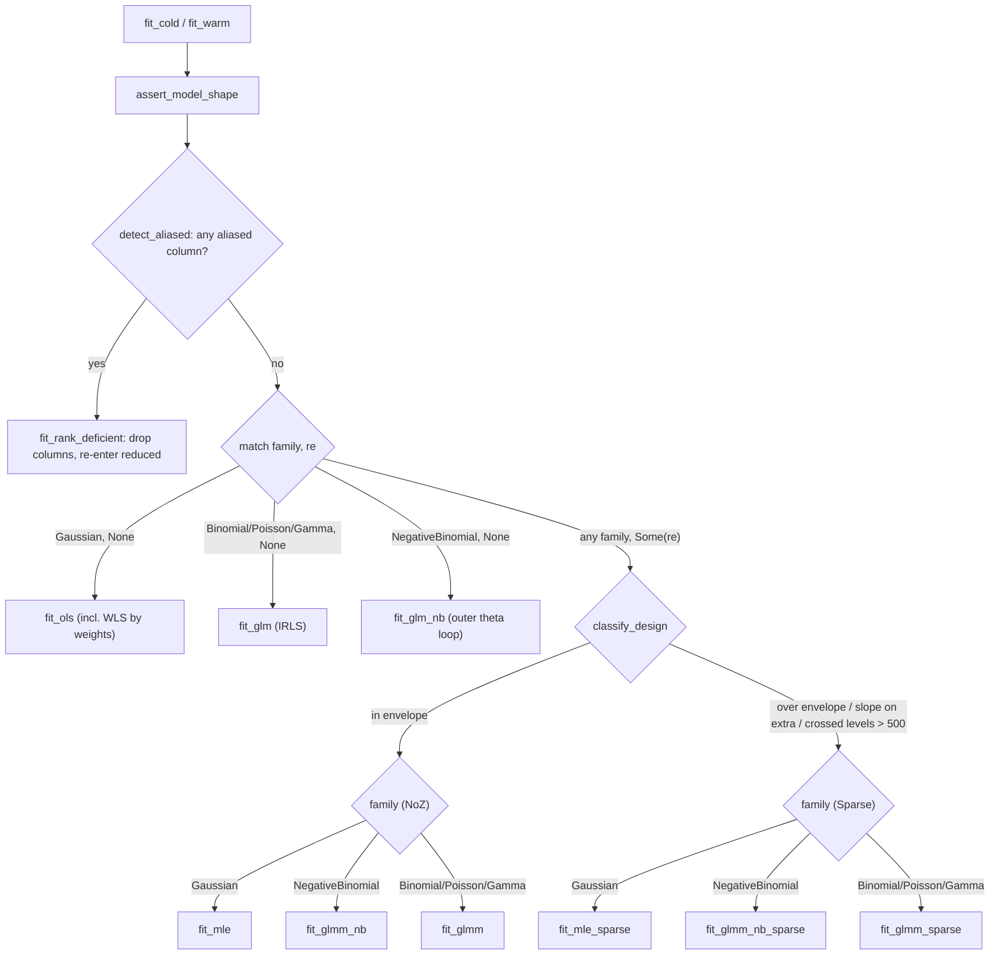

# Algorithm map — dispatch, knobs, OLS & GLM

This is the entry point of the `glmm` algorithm map. It documents, strictly as
built, how a call to `fit_cold`/`fit_warm` reaches a terminal solver, indexes
every tuning knob, and covers the two fixed-effect-only paths (OLS and GLM). The
mixed-model leaves get their own pages:

- [`algorithms-lmm.md`](algorithms-lmm.md) — Gaussian mixed models (LMM).
- [`algorithms-glmm.md`](algorithms-glmm.md) — non-Gaussian mixed models (GLMM).

Family and link coverage is tabled in
[`supported_families.md`](supported_families.md).

## Full dispatch map

Every real fit enters through `fit_warm` (`fit_cold` is exactly
`fit_warm(.., None, ..)`). It shape-checks the inputs (`assert_model_shape`),
runs the rank-deficiency salvage, then matches on `(family, re)`; the mixed arm
routes through `classify_design` to a dense (`NoZ`) or sparse (`Sparse`) solver,
and within each solver the family selects the kernel. This is the whole
as-built decision tree — one graph, no unreachable arms.

**Rank-deficiency salvage.** Before any solver runs, `detect_aliased` forms the
lower-triangular Gram `XᵀX` and rank-reveals it (`ols::aliased_columns`, drop
tolerance `ALIAS_EPS = 1e-14`); if any fixed column is aliased on an earlier one,
`fit_rank_deficient` drops those columns, fits the reduced full-rank model
through a recursive `fit_warm`, and scatters β/SE back to full width with the
dropped slots left `NaN` (lme4's `NA`-coefficient behaviour — the fit still
converges). The reduced design is full rank, so the recursion never re-enters
this branch. An aliased column that is also an RE slope is faulted rather than
mis-indexed. This preprocessing is path-agnostic: it serves OLS, GLM, LMM and
GLMM alike.

**`classify_design` routing (mixed arm only).** A mixed design routes to
`Solver::Sparse` when it is over the dense envelope (primary width
`q_p > MAX_PRIMARY_Q`, more than `MAX_EXTRA_GROUPINGS` extra groupings, or any
extra grouping width `1 + slopes.len() > MAX_EXTRA_Q`), **or** any extra
grouping carries a random slope, **or** the total `Crossed` level count exceeds
`MAX_CROSSED_LEVELS`; otherwise it stays `Solver::NoZ`. The caps are a
scratch-capacity boundary, not a model limit — the router redirects rather than
aborts, so every wired family fits on whichever side it lands and there is **no
reachable `unimplemented!` / panic** in the mixed dispatch. The one hard
rejection is a shape assert: `assert_model_shape` still panics on true invariant
violations (a bad `nagq`, an out-of-range slope column, more than one nested
grouping). The level-count clause reads real `Crossed { n_clusters }`, so the
entry sizes the spec from the row ids (`spec_sized_from_ids`) before classifying.

**Code:** `fit_warm`/`fit_cold`, `detect_aliased`, `fit_rank_deficient`,
`classify_design`, `assert_model_shape`, `spec_sized_from_ids`, `Solver`
(`src/fit.rs`); `aliased_columns`, `ALIAS_EPS` (`src/ols.rs`); envelope caps in
`src/consts.rs`. **Convention:** lme4's rank-deficiency handling (drop aliased
columns, `NA` coefficient, still converge); the `NoZ`/`Sparse` split is a
per-shape kernel choice invisible to the model — both target the identical
lme4/MixedModels.jl optimum. **Validation:** the salvage is pinned by
`fit_rank_deficient_drops_and_matches_reduced` (`src/fit.rs`); the routing
boundary and both solver arms are pinned across the mixed corpus — see the LMM
and GLMM pages for the per-kernel rungs (Dyestuff, sleepstudy, Penicillin,
Pastes, sim_slope_extra on the Gaussian side; cbpp, grouseticks,
`sim_sparse_binomial`, `sim_sparse_poisson` on the non-Gaussian side).

## Legend

- **Node** = a named function the dispatch actually calls; the terminal leaves
  (`fit_ols`, `fit_glm`, `fit_glm_nb`, `fit_mle`, `fit_glmm`, `fit_glmm_nb`, and
  the three `*_sparse` twins) are the solvers. **Diamond** = a real branch in the
  code (`match`, `classify_design`, a guard). **Edge label** = the condition
  under which that branch is taken.
- **Code citations** across all three pages use the form `src/file.rs` plus the
  item name (fn/struct/const) — never line numbers, so a citation survives edits
  to the file. When an item name is unique in the crate the file alone locates it.
- The map grows with the crate: future optimizer tiers and additional families
  will add leaves and edges, but this document tracks only what ships today.

## Knob index

Every tuning surface, one line each, pointing at the page that owns it. Public
`FitOptions` knobs are documented at their use site; internal constants are
tuned on the crate's parity corpus (the 21-rung roadmap, of which 9 are landed —
see the LMM/GLMM validation sections) and are not user-facing.

### Public `FitOptions` fields (`src/fit.rs`, `struct FitOptions`)

| Knob | Meaning | Owned by |
|---|---|---|
| `target_indices` | fixed-effect columns to compute SE for | [OLS](#ordinary-least-squares-ols) / [GLM](#generalised-linear-models-glm) here; LMM SE in [`algorithms-lmm.md`](algorithms-lmm.md#standard-errors); GLMM SE in [`algorithms-glmm.md`](algorithms-glmm.md#standard-errors) |
| `wald_se` | `Hessian` (default) vs `Rx` Wald covariance | GLMM only — [`algorithms-glmm.md`](algorithms-glmm.md#standard-errors) (ignored on OLS/GLM/LMM) |
| `nagq` | AGQ node count, default 1 (Laplace) | GLMM only — [`algorithms-glmm.md`](algorithms-glmm.md#adaptive-gausshermite-quadrature-agq) |
| `dispersion` | Gamma φ directive: `None` estimates, `Some(v)` fixes | [GLM Gamma](#generalised-linear-models-glm) here; Gamma GLMM in [`algorithms-glmm.md`](algorithms-glmm.md#laplace-approximation) |
| `weights` | per-row prior (case) weights `wᵢ` | every path — [OLS](#ordinary-least-squares-ols)/[GLM](#generalised-linear-models-glm) here, mixed paths in the LMM/GLMM pages (rejected only with `nagq > 1`) |
| `parallel_inner` | experimental opt-in to parallel inner kernels | GLMM only — AGQ/FD-Hessian, [`algorithms-glmm.md`](algorithms-glmm.md#standard-errors) (off by default, bit-identical to serial) |

### Internal tuning constants

| Knob | Value / formula | Owned by |
|---|---|---|
| BOBYQA `npt` | `2·n_θ + 1` for `n_θ < 3`, else `(3·n_θ).div_ceil(2) + 1` | [`algorithms-lmm.md`](algorithms-lmm.md#general-path-bobyqa-over-θ) (`src/lmm.rs`) |
| `rho_begin` schedule | `(0.1·min diag θ₀).min(RHO_BEGIN)`, `RHO_BEGIN = 0.5` | [`algorithms-lmm.md`](algorithms-lmm.md#general-path-bobyqa-over-θ) (`src/lmm.rs`) |
| `rho_end` | `RHO_END = 1e-6` | [`algorithms-lmm.md`](algorithms-lmm.md#general-path-bobyqa-over-θ) (`src/lmm.rs`) |
| `PIN_THETA` | `1e-4` — diagonal variance component pinned to `0` | [`algorithms-lmm.md`](algorithms-lmm.md#boundary-handling-pin_theta) (`src/lmm.rs`) |
| `two_stage` warm-start gate | disabled when `n_θ ≤ 2 && p ≤ 4`, else enabled | [`algorithms-glmm.md`](algorithms-glmm.md#β-profiling--the-two-stage-optimizer) (`src/glmm/workspace.rs`) |
| `MAX_PRIMARY_Q` | `8` — primary width cap (over → Sparse) | [dispatch](#full-dispatch-map) (`src/consts.rs`) |
| `MAX_EXTRA_Q` | `4` — per-extra-grouping width cap | [dispatch](#full-dispatch-map) (`src/consts.rs`) |
| `MAX_EXTRA_GROUPINGS` | `6` — extra-grouping count cap | [dispatch](#full-dispatch-map) (`src/consts.rs`) |
| `MAX_CROSSED_LEVELS` | `500` — total crossed-level cap (over → Sparse) | [dispatch](#full-dispatch-map) (`src/consts.rs`) |
| `MAX_NAGQ` | `25` — largest odd AGQ order the GH table stores | [`algorithms-glmm.md`](algorithms-glmm.md#adaptive-gausshermite-quadrature-agq) (`src/consts.rs`) |

The NB GLM outer-loop constants (`NB_MAX_OUTER = 25`, `NB_THETA_TOL = 1e-6`,
`NB_THETA_LO = 1e-3`, `NB_THETA_HI = 1e4`) are covered in the
[GLM section](#generalised-linear-models-glm) below; the GLMM NB path reuses the
same bracket through a global golden-section search
([`algorithms-glmm.md`](algorithms-glmm.md#negative-binomial-outer-θ-loop)).

## Ordinary least squares (OLS)

**Code:** `fit_ols` (`src/fit.rs`); `OlsSuffStats::add_rows`,
`fit_suff_stats_t_sq`, `PANEL_ROWS` (`src/ols.rs`). **Convention:** the textbook
Gaussian OLS normal equations, with R `lm()`'s residual-df and dispersion
conventions. **Validation:** `fit_ols_recovers_slope`, and for the weighted path
`fit_ols_weighted_matches_r_lm` / `fit_ols_constant_weights_invariant`
(`src/fit.rs`). OLS is the fixed-only Gaussian leaf and is not a dedicated
mixed-model parity rung; it is exercised implicitly as the `q_p = 1` degenerate
of the LMM kernels.

`fit_ols` accumulates the sufficient statistics `XᵀX` (lower triangle), `Xᵀy`,
and `yᵀy` in a single panel-blocked pass (`OlsSuffStats::add_rows`, repacking
`PANEL_ROWS = 256`-row panels so the GEMM stays cache-resident), then solves the
normal equations by a Cholesky of `XᵀX`: `L z = Xᵀy`, `Lᵀ β̂ = z`
(`fit_suff_stats_t_sq`). The residual sum of squares is the closed form
`RSS = yᵀy − β̂ᵀXᵀy` — no residual sweep. The dispersion is
`σ̂² = RSS/(n − p)` with **raw-row** residual df `n − p`, and the SE of a target
column is `√(σ̂²·‖L⁻¹e_j‖²)` from one forward solve against the Cholesky factor
(the diagonal of `σ̂²(XᵀX)⁻¹`). A Cholesky failure or near-singular factor (the
rank guard `chol_rank_deficient` at `eps_rank = 1e-12`) returns a non-converged,
`NaN`-filled fit; `Fit::dispersion` is fixed at `1.0` for the Gaussian family
and `Fit::deviance` is left `NaN` on this path.

**WLS by row scaling.** Prior weights (`FitOptions::weights`) are applied as
`√wᵢ` row pre-scaling of both `X` and `y` before the unit-weight accumulator
runs, so the Grams become `XᵀWX`, `XᵀWy`, `yᵀWy`; then `RSS = yᵀWy − β̂ᵀXᵀWy`
is the weighted RSS and `σ̂² = RSS/(n − p)` keeps the raw-row df, matching
R `lm(weights=)`. Constant weights leave the fit invariant.

## Generalised linear models (GLM)

**Code:** `fit_glm` and (for negative binomial) `fit_glm_nb` (`src/fit.rs`);
the IRLS kernel `glm_irls_fit` with its constants `MAX_IRLS_ITERS = 50`,
`DEVIANCE_TOL = 1e-8`, `WEIGHT_CLAMP = 1e-6` (`src/glm.rs`); the SIMD
transcendental fast paths in `src/simd_transcendental.rs`; per-family link,
variance and deviance in `src/family.rs`. **Convention:** McCullagh & Nelder
IRLS with the canonical working response and prior-weight sense; R `glm()`'s
deviance and dispersion, and `MASS::glm.nb` for the NB θ profile.
**Validation:** the weighted goldens `fit_glm_gamma_weighted_matches_r`,
`fit_glm_binomial_weighted_aggregated_matches_r`,
`glm_weighted_deviance_null_golden_value`, and for NB
`fit_glm_nb_matches_mass` / `fit_glm_nb_weighted_matches_mass` (`src/fit.rs`,
`src/glm.rs`). GLM is a fixed-only leaf with no external three-way parity rung of
its own; the cbpp/grouseticks rungs exercise the same family math through the
GLMM cold-start GLM fit.

`fit_glm` runs adaptive IRLS cold-started at β = 0 (Gamma with the inverse link
seeds η = 1/y per row instead — η = 0 is singular under that link; R's
`etastart = 1/y` convention), converging on
`|Δ deviance| < DEVIANCE_TOL` with a `MAX_IRLS_ITERS` safety cap. The `family`
argument selects the arithmetic in two branches:

- **Canonical fused-SIMD path** — `Family::Binomial { link: Logit }` (unweighted)
  runs a verbatim fused kernel that computes the probability `p`, the working
  weight `W`, and the `Σ log1pexp(η)` deviance fold in one vectorised pass over
  the SIMD transcendentals (`src/simd_transcendental.rs`); this is the MCPower
  hot path, kept byte-identical.
- **General Fisher-scoring branch** — every other family (Poisson, Gamma, NB,
  probit binomial, and *weighted* logit) routes the scalar arm, reading its link
  inverse, variance, and deviance residual from `src/family.rs`. Prior weights
  multiply the working weight (`(wᵢ·W_raw).max(WEIGHT_CLAMP)`) and the deviance
  contribution; a weighted logit therefore leaves the fused path for the scalar
  arm (the fused kernel has no per-row weight slot).

**Dispersion.** Binomial and Poisson hold `φ ≡ 1`, so `(XᵀWX)⁻¹` is the full
covariance. **Gamma** recovers `φ` post-fit: the mean model is φ-independent, so
φ stays out of the IRLS, and either `FitOptions::dispersion = Some(v)` fixes it
or `None` estimates the Pearson moment `φ̂ = Σ wᵢrᵢ²/(n − p)` (Pearson residual
`rᵢ = (yᵢ − μ̂ᵢ)/√V(μ̂ᵢ)`, raw-row df) — matching
`summary(glm(family=Gamma))$dispersion`; the SE is then scaled by `√φ̂`.

**Negative-binomial outer θ-loop.** `fit_glm_nb` alternates, `MASS::glm.nb`-style:
(1) fit the GLM at fixed θ; (2) 1-D maximise the NB profile log-likelihood
`nb_profile_loglik` over `ln θ` on the bracket `[ln 1e-3, ln 1e4]`
(`NB_THETA_LO`/`NB_THETA_HI`) by golden-section (`golden_max_ln_theta` /
`optimize_nb_theta`); (3) repeat until `|Δθ|/θ < NB_THETA_TOL = 1e-6`, capped at
`NB_MAX_OUTER = 25` alternations. Integer counts make the `lnΓ` difference an
exact finite sum (`Σ_{k<y} ln(θ+k)`, no `lgamma`), identical to `MASS::theta.ml`.
θ̂ is reported as `Fit::dispersion`; the β SE conditions on θ̂ (θ-uncertainty out
of scope, the lme4/MASS convention). The cold seed is a method-of-moments
`θ₀ = ȳ²/max(s²−ȳ, ε)`. (The GLMM NB path uses the same bracket but a single
global golden-section search rather than this warm-seeded alternation — see
[`algorithms-glmm.md`](algorithms-glmm.md#negative-binomial-outer-θ-loop).)

## Where this goes

The leaves of the dispatch map are intended to become the coverage checklist for
path-level testing and timing: every terminal solver, and every routing edge that
reaches it, is a cell that should be pinned by a rung or a golden and, eventually,
timed. Wiring the map into the grid/test harness, and any file restructuring the
map motivates, is follow-up work and deliberately outside this documentation
change.

## References

- McCullagh, P. & Nelder, J. A. (1989). *Generalized Linear Models* (2nd ed.).
  Chapman & Hall. — the IRLS/Fisher-scoring formulation `fit_glm` implements.
- Venables, W. N. & Ripley, B. D. (2002). *Modern Applied Statistics with S*
  (4th ed.). Springer. — `MASS::glm.nb` / `theta.ml`, the NB outer-loop
  convention `fit_glm_nb` matches.
- Bates, D., Mächler, M., Bolker, B. & Walker, S. (2015). Fitting Linear
  Mixed-Effects Models Using lme4. *Journal of Statistical Software*, 67(1),
  1–48. — the rank-deficiency (`NA`-coefficient) and mixed-model conventions
  the dispatch targets.
